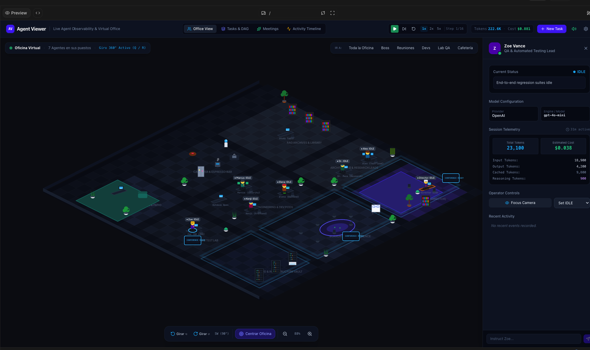
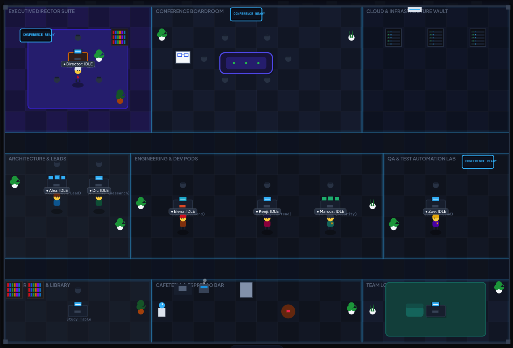

  

  <strong>Watch your AI agents work.</strong> 
  A living virtual office for agent activity, collaboration, tokens and costs.

  
  
  
  

  <a href="#preview">Preview</a> ·
  <a href="#the-idea">The idea</a> ·
  <a href="#planned-capabilities">Capabilities</a> ·
  <a href="#project-status">Project status</a> ·
  <a href="#contribute">Contribute</a> ·
  <a href="#en-español">Español</a>

## The idea

**Agent Viewer turns agent activity into a workplace you can understand at a glance.** A director coordinates leaders; leaders delegate to analysts; agents work at their desks, exchange messages and gather in meeting rooms. Alongside the office, an inspector explains who is doing what, which model is involved, and how many tokens and dollars the work consumes.

The goal is a modern, expressive office with animated characters, readable conversations and purposeful movement. Every operational action should be tied to an agent event, so you can follow the actual work as well as its visual representation.

**Built to be free, downloadable and community driven.** The aim is to make agent collaboration easier to understand and share.

## Preview

*Interface preview supplied by the author. These images show the visual direction; they do not establish that live integrations or the displayed telemetry are available in this repository.*

<strong>See the office layout and its nine areas</strong>

 

## Planned capabilities

The following table describes the intended product scope. Implementation has not yet been published here.

| Capability | What you will be able to see |
|---|---|
| **Animated office** | Agents walking, working, talking and taking seats in meetings, with consistent character and furniture detail. |
| **Team hierarchy** | A director, team leaders and analysts, with visible delegation and reporting relationships. |
| **Conversations** | Brief speech bubbles above characters and a conversation panel with participants, timestamps and context. |
| **Meetings** | Participants, agenda, decisions and follow-up tasks connected to the work being discussed. |
| **Tasks and dependencies** | Assignments, progress, handoffs and blockers, alongside the office view. |
| **Agent inspector** | Role, provider, model, current state, tools, recent activity and session usage. |
| **Token and cost visibility** | Input and output usage per agent, task and meeting; cached or reasoning usage when reported by the provider. |
| **Activity timeline and replay** | A chronological record of events and the ability to revisit a session. |
| **Integration adapters** | A shared event contract that different agent tools and frameworks can publish to. |

### An office with a purpose

| Area | Role in the experience |
|---|---|
| **Executive Director Suite** | Coordination, priorities and escalations. |
| **Conference Boardroom** | Team meetings, decisions and collaborative reviews. |
| **Cloud & Infrastructure Vault** | Infrastructure activity and operational monitoring. |
| **Architecture & Leads** | Planning, technical reviews and delegation. |
| **Engineering & Dev Pods** | Implementation and tool execution. |
| **QA & Test Automation Lab** | Validation, test results and feedback. |
| **Research Archives & Library** | Research, document analysis and knowledge gathering. |
| **Cafeteria / Espresso Bar** | Informal conversations and pauses. |
| **Team Lounge** | Team interaction and a quieter shared space. |

Room design should make these roles recognizable through desks, computers, chairs, plants, shelves and presentation screens. Labels and dialogue bubbles should remain readable while the office is panned, rotated or zoomed.

## How it is intended to work

1. Your existing agent runtime emits a task, message, tool, meeting or usage event.
2. An adapter maps it to Agent Viewer's common event contract.
3. The event is recorded and streamed to the viewer.
4. The office animates the activity while the inspector and timeline show its details.

The integration layer is intended to work with existing agent runtimes. Support for individual providers and tools will be documented as adapters are implemented and verified.

### Event-driven visualization

Examples of event names under consideration:

| Event | Visual response |
|---|---|
| `task.assigned` | Show the owner and the delegation relationship. |
| `agent.message.sent` | Show a speech bubble and the recipient in the conversation panel. |
| `meeting.started` | Bring the participants into the meeting view. |
| `tool.called` | Update the agent's activity and show the tool call. |
| `llm.usage.recorded` | Update usage totals and any available cost estimate. |
| `approval.requested` | Highlight the waiting agent and the action needing attention. |
| `task.completed` | Show completion and the handoff or deliverable. |

These are design examples, not a published API contract.

**Usage must remain explainable:** report provider usage where available, distinguish unknown values from zero, label estimated costs, and avoid counting the same event twice. Displayed conversations should come from emitted messages or summaries; they should not imply access to hidden model reasoning.

## Proposed architecture

Technology choices below describe the planned architecture, not dependencies already present in the repository.

| Layer | Proposed technology | Purpose |
|---|---|---|
| Application UI | React + TypeScript | Navigation, inspectors, tasks, meetings and timeline. |
| Office renderer | PixiJS | Animated office, characters, camera and visual effects. |
| Backend | ASP.NET Core 10 | Event ingestion, query APIs and session management. |
| Live updates | SignalR | Stream activity to connected viewers. |
| Persistence | PostgreSQL | Sessions, events, tasks, messages and usage records. |
| Background processing | .NET Workers | Event processing and integration support. |
| Ephemeral state | Redis, where needed | Short-lived coordination and cache. |
| Observability | OpenTelemetry | Correlate agent activity with traces. |

The event contract separates the agent runtime from the office renderer. An adapter should not need to know how a character is drawn, and the renderer should not depend on a specific model provider.

## Project status

**This repository currently contains the project README and visual reference assets.** Application source code, installation instructions, integration adapters and downloadable releases have not yet been published.

The previews reflect interface work outside this repository. Planned capabilities above should be read as the product direction.

You can [star the project](https://github.com/jmmana/Agent-Viewer/stargazers) and use GitHub's **Watch → Custom → Releases** to follow future downloads.

### Roadmap

- [ ] Publish the application source and reproducible setup instructions.
- [ ] Define and validate the event schema.
- [ ] Refine office composition, room details, characters and dialogue bubbles.
- [ ] Connect agent states, messages and handoffs to recorded events.
- [ ] Implement meetings, task views and the activity timeline.
- [ ] Add token accounting and clearly labeled cost estimates.
- [ ] Publish and verify the first runtime adapter.
- [ ] Add session replay and downloadable releases.
- [ ] Document contribution guidelines and add an open-source license.

## Contribute

Interested in office animation, character design, agent integrations or observability?

- [Open an issue](https://github.com/jmmana/Agent-Viewer/issues/new) with a focused proposal, use case or visual improvement.
- For interface feedback, include a screenshot and describe the expected behavior.
- For an adapter proposal, explain which runtime emits the events and which usage fields it exposes.
- For code contributions, coordinate the scope in an issue before starting.

The source and setup instructions will be added before implementation contributions can be reproduced locally.

## License

An open-source license has not yet been added. Free distribution and open-source collaboration are the project goals; the license terms will be published in a `LICENSE` file.

## Author

Created by **[Juan Manuel Castillo Pinto](https://github.com/jmmana)** · **WarlockCode**

[LinkedIn](https://linkedin.com/in/jmmana) · [Portfolio](https://juancastillo.bio)

## En español

**Agent Viewer — Mira cómo trabajan tus agentes de IA.**

Una oficina virtual animada donde un director, líderes y analistas representan el trabajo de los agentes: tareas, conversaciones, reuniones, herramientas, consumo de tokens y costos.

La idea es que puedas entender quién está trabajando, con quién se coordina, qué está bloqueado y cuánto consume cada tarea. Los movimientos y mensajes deben reflejar eventos del sistema conectado.

El objetivo es crear una herramienta **gratuita, descargable y abierta a la comunidad**. Este repositorio contiene por ahora la presentación y las imágenes de referencia; el código, las integraciones, las instrucciones de instalación y la licencia están pendientes de publicación.

Si te interesa la idea, deja una estrella o comparte una propuesta en los issues.
