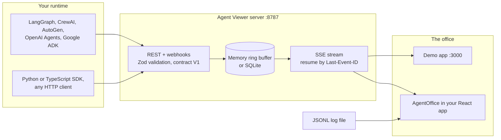

<!-- Header -->
<p align="center">
  
</p>

<p align="center">
  <a href="#-quickstart">
    
  </a>
</p>

<p align="center">
  <a href="https://github.com/jmmana/Agent-Viewer/actions/workflows/ci.yml"></a>
  <a href="CHANGELOG.md"></a>
  <a href="LICENSE"></a>
  <a href="https://github.com/jmmana/Agent-Viewer"></a>
  <a href="https://github.com/jmmana/Agent-Viewer/network/members"></a>
</p>

<p align="center">
  
  
  
  
  
  <a href="#-roadmap"></a>
</p>

<p align="center">
  <a href="#-quickstart"><b>Quickstart</b></a> ·
  <a href="#-embed-the-office-in-your-react-app"><b>Embed</b></a> ·
  <a href="#-connect-your-agents"><b>Connect agents</b></a> ·
  <a href="#-event-contract-v1"><b>Event contract</b></a> ·
  <a href="#-server-and-api"><b>Server API</b></a> ·
  <a href="#-roadmap"><b>Roadmap</b></a> ·
  <a href="docs/README.es.md"><b>Español</b></a>
</p>

<p align="center">
  
</p>
<p align="center">
  <sub>The demo app (<code>npm run dev</code>) playing its scripted demonstration. Every agent, line and token figure in the demo is simulated. Embedded in your app, the office draws only what your events say.</sub>
</p>

---

<h3 align="center">Your agents already talk to each other. Now you can watch them do it.</h3>

A multi-agent run is a conversation you cannot see. The planner delegates, the coder calls tools, the reviewer objects, two agents meet and settle on a decision, and all you get is a wall of JSON scrolling past. Something blocks, and you go hunting through logs to find out who was waiting on whom.

**Agent Viewer turns that event stream into a living office.** Every agent gets a desk, a status and a name card. Tool calls show up as they happen. Messages become speech bubbles headed by what they do: `PROPOSES`, `OBJECTS`, `AGREES`, `DECIDES`. Meetings fill a room and leave decisions behind. Who is working, who is blocked and who is talking to whom: one look.

It is open source (MIT), runs on your machine, needs no model API key, and drops into any React 19 app as a single component.

<table>
  <tr>
    <td align="center" width="25%"><h2>22</h2><sub>canonical event types<br/>in contract V1</sub></td>
    <td align="center" width="25%"><h2>9</h2><sub>rooms agents<br/>work and meet in</sub></td>
    <td align="center" width="25%"><h2>EN · ES</h2><sub>116 text keys,<br/>all replaceable</sub></td>
    <td align="center" width="25%"><h2>0</h2><sub>usage figures computed<br/>by the component</sub></td>
  </tr>
</table>

---

## 🎯 What you get

| Piece | What it does |
|---|---|
| 🏢 **Living office** | React + Canvas2D scene with 9 rooms. Agents walk to their desks and to meeting rooms, show their status and the tool they use, and talk in speech bubbles headed by the kind of message. Rotate, fit, pan, zoom and click to select. |
| 🧩 **Embeddable library** | `@warlockcode/agent-viewer`: `<AgentOffice events={events} />` in any React 19 app. Professional mode by default, isolated `av-` CSS, English and Spanish built in, replay controls and video export. |
| 📡 **Ingestion server** | Express API on port 8787: single and batch ingestion with idempotency, a Server-Sent Events stream that resumes from the last event, a generic webhook with HMAC signatures, in-memory or SQLite storage. |
| 🐍 **SDKs and adapters** | Python and TypeScript clients, plus example adapters for LangGraph, CrewAI, AutoGen, OpenAI Agents SDK and Google ADK. |
| 🎬 **Replay and export** | Load a JSONL V1 log, replay it at its original pace with seek and speed, and record it to WebM or MP4 in the browser. |
| 📊 **Model Ops console** | In the demo app: tokens and reported cost by provider and model, aggregated from `llm.usage` events. |

## 🧠 Principles

These are design rules, enforced in code, not marketing:

1. **Your runtime is the source of truth.** Agent Viewer projects events; it never decides what an agent is doing. Animation never overwrites a real work status (`IDLE`, `THINKING`, `CODING`...).
2. **Observable only.** Statuses, tool names, explicit messages, meetings and reported usage. Private chain-of-thought is never required and never shown.
3. **Nothing invented in professional mode.** The embedded office has no ambient life, no invented lines, no sounds. Showcase mode adds simulated office life, and every simulated bubble says so (`SOCIAL · SIMULATED`).
4. **Unknown is not zero.** The component never computes, adds up or prices usage. A missing cost is shown as "unknown", never as `0`.
5. **A good guest in your app.** No injected styles, no global selectors, no `localStorage`, no global keyboard shortcuts, nothing runs on import. Two offices on one page never share state.

**What it is not:** a tracing backend, a log store or an APM replacement. It does not import OTLP traces yet, it does not call model providers, and the framework adapters are examples to adapt, not packaged integrations. See the [maturity table](#-connect-your-agents).

---

## ⚡ Quickstart

Working on the repository requires Node.js 24 or later. Apps that only install the library need React 19, nothing else.

```bash
git clone https://github.com/jmmana/Agent-Viewer.git
cd Agent-Viewer
npm ci
npm run dev:full   # ingestion server on :8787 + office on :3000 in live mode
```

| Command | Open | What you get |
|---|---|---|
| `npm run dev:full` | **http://localhost:3000** | Live mode: an empty office (no seeded agents, no synthetic tokens) streaming from the server on port 8787. Events you send appear right away. |
| `npm run dev` | **http://localhost:3000** | The demo: the full living office with a simulated team and simulated data. Press **Space** (or Play) to run the scripted demonstration. Add `?mode=live` (or set `VITE_AGENT_VIEWER_MODE=live`) to switch it to live mode. |

### Send your first events

With `npm run dev:full` running, send these from another terminal and watch them land:

```bash
# 1. A planner joins the office and sits in Architecture
curl -X POST http://localhost:8787/api/v1/events \
  -H "Content-Type: application/json" \
  -d '{
    "schemaVersion": "1.0",
    "id": "evt_hello_1",
    "type": "agent.registered",
    "timestamp": 1767225600000,
    "source": "cli",
    "agentId": "nova",
    "summary": "Nova joined the office",
    "payload": { "name": "Nova", "roleTitle": "Planner", "workspace": "leads_area" }
  }'

# 2. Nova proposes something: a speech bubble headed "PROPOSES"
curl -X POST http://localhost:8787/api/v1/events \
  -H "Content-Type: application/json" \
  -d '{
    "schemaVersion": "1.0",
    "id": "evt_hello_2",
    "type": "agent.message.sent",
    "timestamp": 1767225601000,
    "source": "cli",
    "agentId": "nova",
    "summary": "Nova proposes a plan",
    "payload": { "text": "Ship the parser first, then the exporter.", "kind": "proposal" }
  }'
```

No envelope at hand? The generic webhook takes a flat body and builds the events for you:

```bash
curl -X POST http://localhost:8787/api/v1/webhooks/generic \
  -H "Content-Type: application/json" \
  -d '{ "agent": "atlas", "status": "coding", "message": "Writing the parser", "tool": "editor" }'
```

### Or with Docker

```bash
docker compose -f docker/compose.yml up --build
```

This starts the API on **:8787** with SQLite on a named volume, and the built demo on **:3000**. Open **http://localhost:3000/?mode=live** to watch the stream.

---

## 🧩 Embed the office in your React app

<p align="center">
  
</p>
<p align="center">
  <sub><code>&lt;AgentOffice locale="es" /&gt;</code> in professional mode: a meeting where agents propose, object, agree and decide. Only the events passed to the component are drawn.</sub>
</p>

Agent Viewer is also a React library: **`@warlockcode/agent-viewer` 0.2.1**. ES modules only, React and React DOM 19 as peer dependencies, `lucide-react` and `zod` as its only runtime dependencies, TypeScript declarations included.

Publication on npm is coming soon. Until then, install it from the GitHub release asset (the package name and your imports stay the same when you switch to npm):

```bash
npm install https://github.com/jmmana/Agent-Viewer/releases/download/v0.2.1/warlockcode-agent-viewer-0.2.1.tgz
```

### Minimal example

```tsx
import { AgentOffice, type AgentProfile, type OfficeEventInput } from '@warlockcode/agent-viewer';
import '@warlockcode/agent-viewer/style.css';

// Defined outside the component, so the arrays keep the same identity on every render.
const agents: AgentProfile[] = [
  { id: 'planner', name: 'Nova', roleTitle: 'Planner', workspace: 'leads_area', avatarColor: '#38bdf8' },
  { id: 'builder', name: 'Atlas', roleTitle: 'Builder', workspace: 'development', avatarColor: '#f472b6' },
];

const events: OfficeEventInput[] = [
  {
    schemaVersion: '1.0',
    id: 'evt-001',
    type: 'agent.status.changed',
    timestamp: 1767225600000,
    source: 'agent:builder',
    agentId: 'builder',
    summary: 'Builder started coding',
    payload: { status: 'CODING', statusText: 'Writing the parser' },
  },
  {
    schemaVersion: '1.0',
    id: 'evt-002',
    type: 'agent.message.sent',
    timestamp: 1767225601000,
    source: 'agent:planner',
    agentId: 'planner',
    summary: 'Planner proposes an order',
    payload: { text: 'Ship the parser first, then the exporter.', kind: 'proposal', targetAgentId: 'builder' },
  },
];

export function TeamOffice() {
  return (
    <div style={{ height: 520 }}>
      <AgentOffice agents={agents} events={events} locale="en" theme="dark" />
    </div>
  );
}
```

Atlas appears at a desk in Engineering with the status "Coding". Nova appears in Architecture with a speech bubble headed `Nova → Atlas · PROPOSES` for 6.5 seconds. The office fills its container (at least 320 px tall), so give the container a height.

### Live events

`<AgentOffice>` is controlled by `events`: append each new event and pass the new array. Events can come from anywhere (your WebSocket, a store, a polling loop). `connectEventStream` is a helper for the SSE stream of an Agent Viewer server:

```tsx
import { useEffect, useState } from 'react';
import { AgentOffice, connectEventStream, type OfficeEventInput } from '@warlockcode/agent-viewer';

export function LiveOffice() {
  const [events, setEvents] = useState<OfficeEventInput[]>([]);

  useEffect(() => {
    const connection = connectEventStream('http://localhost:8787', (event) => {
      setEvents((list) => [...list, event]);
    });
    return () => connection.close();
  }, []);

  return (
    <div style={{ height: 600 }}>
      <AgentOffice events={events} />
    </div>
  );
}
```

Give every event a stable, unique `id`: the office ignores ids it has already applied. Pass a new array when events change (mutating in place is not detected), and keep `agents`, `messages` and `t` stable between renders.

### Two modes

| Mode | What the office shows |
|---|---|
| `professional` (default) | Only what the events say. No ambient life, no invented lines, no hidden second floor, no sounds. When a meeting is requested, participants just walk to the room. |
| `showcase` | Adds simulated office life for demos: idle agents go for coffee and chat in short simulated conversations, headed `SOCIAL · SIMULATED`. They never change an agent's work status. |

### Dark or light, English or Spanish

<table>
  <tr>
    <th align="center" width="50%">Dark · Spanish</th>
    <th align="center" width="50%">Light · English</th>
  </tr>
  <tr>
    <td></td>
    <td></td>
  </tr>
  <tr>
    <td align="center"><code>theme="dark" locale="es"</code></td>
    <td align="center"><code>theme="light" locale="en"</code></td>
  </tr>
</table>

Every visible text comes from a catalog of 116 keys. Rename a room with `messages`, or plug in i18next or FormatJS with `t`. The `--av-*` CSS custom properties restyle the toolbar and panels with zero specificity.

### Accessible by default

- A live, polite list of every agent with its role and status. It opens when it receives keyboard focus (**Tab**), and each agent is a button that selects it and moves the camera to it.
- A labeled canvas, a real toolbar with named buttons and a visible focus ring.
- With `prefers-reduced-motion: reduce`, nothing animates: agents move without walking.

<details>
<summary><b>📦 Everything the package exports</b></summary>
<br/>

| Area | Values |
|---|---|
| Office | `AgentOffice` |
| Office model without React | `OfficeStore`, `buildOfficeSnapshot` |
| Replay | `useEventReplay`, `ReplayControls` |
| Usage (display only) | `formatUsage`, `formatTokens`, `formatCost`, `summarizeUsage` |
| Texts | `OFFICE_MESSAGES`, `createOfficeTranslator`, `formatMessage`, `builtInMessages`, `isOfficeMessageKey` |
| Event contract V1 | `SCHEMA_VERSION`, `CANONICAL_EVENT_TYPES`, `EVENT_TYPE_ALIASES`, `MESSAGE_KINDS`, `isMessageKind`, `normalizeCanonicalEvent`, `validateCanonicalEvent` |
| Live stream | `connectEventStream` |
| Log files | `parseEventLog`, `MAX_EVENT_LOG_SIZE_BYTES` |
| Video | `recordReplay`, `computeReplaySchedule`, `isRecordingSupported`, `getSupportedMimeType` |

Types for all of them are included. The stylesheet is `@warlockcode/agent-viewer/style.css`.

</details>

<details>
<summary><b>⏯️ Replay a recorded run</b></summary>
<br/>

`useEventReplay` plays a run at its own pace and returns the visible slice. It only reveals events; it never creates any.

```tsx
import { AgentOffice, ReplayControls, useEventReplay, type OfficeEventInput } from '@warlockcode/agent-viewer';

export function RunReplay({ run }: { run: readonly OfficeEventInput[] }) {
  const replay = useEventReplay(run, { speed: 2, maxGapMs: 3000 });

  return (
    <div style={{ display: 'grid', gridTemplateRows: '1fr auto', gap: 8, height: 600 }}>
      <AgentOffice events={replay.events} />
      <ReplayControls replay={replay} speeds={[1, 2, 4, 8]} />
    </div>
  );
}
```

Load a JSONL V1 log with `parseEventLog(file)` (up to 25 MB, invalid lines reported without stopping) and pass `result.events` as the run. Export it to video with `recordReplay({ events, speed: 4 })`, which draws on its own offscreen canvas.

</details>

<details>
<summary><b>💰 Show usage figures (that you computed)</b></summary>
<br/>

```tsx
import { useMemo } from 'react';
import { AgentOffice, type OfficeEventInput, type OfficeUsage } from '@warlockcode/agent-viewer';

export function OfficeWithUsage({ events }: { events: readonly OfficeEventInput[] }) {
  const usage = useMemo<OfficeUsage>(() => ({
    total: { totalTokens: 18400, inputTokens: 15200, outputTokens: 3200, cost: 0.42, currency: 'USD' },
    byAgent: {
      planner: { totalTokens: 6100, cost: null },
      builder: { totalTokens: 12300, cost: 0.42, currency: 'USD' },
    },
  }), []);

  return (
    <div style={{ height: 520 }}>
      <AgentOffice events={events} showUsage usage={usage} />
    </div>
  );
}
```

`showUsage` is off by default. A missing value is shown as "unknown", never as zero. No usage service? `summarizeUsage(events)` is an explicit opt-in that only adds up what `llm.usage` events reported, and returns an unknown cost rather than a partial sum.

</details>

**Full guide:** props, event effects, workspaces, translations, theming, usage rules, replay, video export and the store without React are in the [library guide](docs/library.md) ([español](docs/library.es.md)).

---

## 🏢 Inside the office

Agents sit in the room named by their `workspace`. Rooms are stable API values; their labels are translated.

| `workspace` | Room | Good for |
|---|---|---|
| `boss_office` | DIRECTOR SUITE | Orchestration, escalation and decisions. Fallback meeting room. |
| `leads_area` | ARCHITECTURE | Planning, delegation and technical review. |
| `development` | ENGINEERING | Coding, implementation and tool execution. |
| `qa_lab` | QA LAB | Testing and validation. |
| `research_area` | RESEARCH LIBRARY | Research, retrieval and document analysis. |
| `server_room` | MODEL OPS | Provider, model and token telemetry. |
| `meeting_room` | MEETING ROOM A | Meetings, 4 seats. |
| `meeting_room_b` | MEETING ROOM B | Overflow meetings, 4 seats. |
| `break_room` | ESPRESSO BAR | Idle time. Coffee and small talk in showcase mode. |

**Speech bubbles say what a message does.** Pass a `kind` in `agent.message.sent` (or `type` in `meeting.message`) and the bubble reads `Speaker → Target · HEADER`:

| Kind | English header | Spanish header |
|---|---|---|
| `statement` | SAYS | DICE |
| `proposal` | PROPOSES | PROPONE |
| `question` | ASKS | PREGUNTA |
| `answer` | ANSWERS | RESPONDE |
| `objection` | OBJECTS | OBJETA |
| `critique` | CRITIQUES | CRITICA |
| `agreement` | AGREES | ACUERDA |
| `summary` | SUMMARIZES | RESUME |
| `decision` | DECIDES | DECIDE |

The office never guesses a kind. A `decision` in a meeting is also recorded in the meeting decisions.

<details>
<summary><b>🚦 All 23 agent statuses</b></summary>
<br/>

`OFFLINE`, `IDLE`, `AVAILABLE`, `THINKING`, `READING`, `RESEARCHING`, `CODING`, `WRITING`, `TESTING`, `USING_TOOL`, `WAITING`, `WAITING_APPROVAL`, `BLOCKED`, `DELEGATING`, `PHONE_CALL`, `WALKING`, `IN_MEETING`, `COFFEE_BREAK`, `CHATTING`, `REVIEWING`, `DELIVERING`, `DONE`, `ERROR`.

Statuses are case insensitive in events; unknown ones are ignored. `tool.started` sets `USING_TOOL`, `tool.failed` sets `ERROR`, a requested meeting sets `WALKING` and then `IN_MEETING`.

</details>

---

## 🔌 Connect your agents

Honest maturity, so you know what you are getting:

| Integration | Where | Maturity |
|---|---|---|
| **REST API, batch, SSE** | [`server/`](server/index.ts) | ✅ **Stable.** Covered by integration, SSE and webhook security tests in CI. |
| **Generic webhook** | `POST /api/v1/webhooks/generic` | ✅ **Stable.** Flat body, optional HMAC-SHA256 with a 5 minute replay window. |
| **Python SDK** | [`sdk/python/`](sdk/python/agent_viewer.py) | ✅ **Stable.** Standard library only, tested against a live server in CI. Not on PyPI yet. |
| **TypeScript SDK** | [`sdk/typescript/`](sdk/typescript/index.ts) | ✅ **Stable.** Tested in CI. Not a separate package yet: import it from a checkout. |
| **JSONL log replay** | [`parseEventLog`](docs/event-log.md) | ✅ **Stable.** Library API, and drag and drop in the demo app. |
| **LangGraph** | [`examples/langgraph-adapter.ts`](examples/langgraph-adapter.ts) | 🧪 **Example adapter.** Node, tool and usage callbacks mapped to SDK calls. Type-checked in CI, not run against LangGraph. |
| **CrewAI** | [`examples/crewai-adapter.py`](examples/crewai-adapter.py) | 🧪 **Example adapter.** Crew agents, tasks, tools, messages and usage. Not run in CI. |
| **AutoGen** | [`examples/autogen-adapter.py`](examples/autogen-adapter.py) | 🧪 **Example adapter.** Conversable agents and group chat messages, tools and usage. Not run in CI. |
| **OpenAI Agents SDK** | [`examples/openai-agents-adapter.ts`](examples/openai-agents-adapter.ts) | 🧪 **Example adapter.** Agent runs, handoffs, tools and usage. Type-checked in CI. |
| **Google ADK** | [`examples/google-adk-adapter.ts`](examples/google-adk-adapter.ts) | 🧪 **Example adapter.** Gemini turns, function calls and usage. Type-checked in CI. |
| **OTLP traces** | none | ❌ **Not supported yet.** `parseEventLog` says so instead of guessing. On the [roadmap](#-roadmap). |

<sub>✅ stable and tested · 🧪 example code you wire into the framework's own callbacks (the adapters do not import the frameworks) · ❌ not available</sub>

Every adapter follows the same trust boundary: only observable states, messages and reported usage leave your runtime. Never send API keys or private system prompts through the event stream.

### Python SDK

A single module with no third-party dependencies. Install it from a clone with `pip install ./sdk/python` (or copy `agent_viewer.py` into your project):

```python
import os
from agent_viewer import AgentViewer

viewer = AgentViewer(url="http://localhost:8787", token=os.getenv("AGENT_VIEWER_API_TOKEN"), runtime_id="my-crew")
analyst = viewer.agent("analyst", name="Iris", role_title="Market analyst", workspace="research_area")

analyst.researching("Reading the quarterly filings")
analyst.tool_started("filing_fetcher", input_summary="Form 10-K")
analyst.tool_completed("filing_fetcher", output_summary="42 pages retrieved")
analyst.usage("OpenAI", "gpt-4o", input_tokens=4200, output_tokens=320, cost=0.024)
analyst.message("Overview ready for review.", target_agent_name="Nova")
analyst.done("Summary delivered")
```

The agent registers itself on its first call. Requests retry with backoff, and `usage()` without a `cost` reports it as unknown.

### TypeScript SDK

```ts
import { AgentViewer } from './sdk/typescript/index';

const viewer = new AgentViewer({ url: 'http://localhost:8787', apiKey: process.env.AGENT_VIEWER_API_TOKEN, runtimeId: 'my-crew' });
const builder = viewer.agent({ id: 'builder', name: 'Atlas', roleTitle: 'Builder', workspace: 'development' });

await builder.coding('Implementing the webhook handler');
await builder.toolStarted('npm.test', 'unit suite');
await builder.toolCompleted('npm.test', '128 passed');
await builder.usage({ provider: 'Anthropic', model: 'claude-sonnet-4-5', inputTokens: 1800, outputTokens: 450, cost: 0.012 });
await builder.message('Handler is ready for review.', 'Nova');
await builder.done('Pull request opened');
```

Several crews can share one server: tag each client with its own `runtimeId` and `sessionId`, then filter with `GET /api/v1/events?runtimeId=...`. More in the [integration guide](docs/integration.md).

---

## 📜 Event contract V1

One envelope for everything. Producers send it; the server validates it with Zod; the office draws it.

```json
{
  "schemaVersion": "1.0",
  "id": "evt_1791190800000_abc123",
  "type": "agent.status.changed",
  "timestamp": 1791190800000,
  "runtimeId": "crewai-production",
  "sessionId": "run-2026-001",
  "source": "agent:researcher",
  "agentId": "researcher",
  "taskId": "task_01",
  "severity": "normal",
  "summary": "Research started",
  "payload": { "status": "RESEARCHING", "workspace": "research_area" }
}
```

| Field | Type | Description |
|---|---|---|
| `schemaVersion` | `"1.0"` | Contract version. |
| `id` | `string` | Unique event id, also the idempotency key. |
| `type` | `string` | One of the 22 canonical types (aliases accepted). |
| `timestamp` | `number` | Unix epoch in milliseconds. |
| `source` | `string` | Producer, for example `runtime:crewai` or `agent:researcher`. |
| `agentId` | `string?` | The agent the event is about. |
| `runtimeId`, `sessionId`, `taskId` | `string?` | Grouping for multi-runtime setups, sessions and tasks. |
| `severity` | `string?` | `low`, `normal` (default), `high` or `critical`. |
| `summary` | `string` | Human-readable line, not empty. |
| `payload` | `object` | Type-specific details. |

<details>
<summary><b>📋 The 22 event types and what they do in the office</b></summary>
<br/>

| Category | Type | Effect |
|---|---|---|
| Agent | `agent.registered` | Adds the agent (name, role title, team, workspace, avatar color, provider, model). |
| | `agent.updated` | Updates the profile; a valid `workspace` becomes its new home. |
| | `agent.status.changed` | Sets the status; the agent moves only when a `workspace` is given. |
| | `agent.message.sent` | Speech bubble, with optional `kind` and target (a dashed line joins both agents). |
| Tasks | `task.created`, `task.assigned`, `task.progress` | Recorded. |
| | `task.completed`, `task.failed`, `task.blocked` | `DONE`, `ERROR` or `BLOCKED` for the agent working on it. |
| Tools | `tool.started`, `tool.completed`, `tool.failed` | `USING_TOOL`, then `IDLE` or `ERROR`. |
| Meetings | `meeting.requested` | Reserves the first free room; participants walk there and the meeting starts when all arrive. |
| | `meeting.started` | Starts at once. |
| | `meeting.message` | Bubble headed by its kind; a `decision` is added to the meeting decisions. |
| | `meeting.ended`, `meeting.cancelled` | Frees the room; participants walk back to their workspace. |
| Telemetry | `llm.usage` | Provider, model, input, output, cached and reasoning tokens, latency, cost, cost source and currency. |
| Runtime | `runtime.connected`, `runtime.disconnected`, `runtime.heartbeat` | Runtime health; no visible change. |

Aliases such as `message.sent`, `meeting.decision` or `approval.requested` are mapped to their canonical type. The complete effect table is in the [library guide](docs/library.md#how-events-change-the-office), and the schema in [`canonicalContract.ts`](src/integrations/canonicalContract.ts).

</details>

**Usage rule:** report `cost` when the provider gives it (`costSource: "provider-reported"`). When you do not know it, send `null` with `costSource: "unknown"`: it stays unknown all the way to the screen. Logs use the same envelope, one event per line: see [event-log.md](docs/event-log.md).

---

## 📡 Server and API



| Method | Endpoint | Purpose |
|---|---|---|
| `GET` | `/health` | Status, version, schema version and connected SSE clients. |
| `GET` | `/ready` | Storage readiness. |
| `POST` | `/api/v1/events` | Ingest one event. Honors the `Idempotency-Key` header. |
| `POST` | `/api/v1/events/batch` | Ingest up to 100 events (configurable). Duplicates are skipped, not errors. |
| `GET` | `/api/v1/events` | Query with `limit`, `since`, `afterId`, `runtimeId`, `sessionId`, `agentId`, `type`. |
| `GET` | `/api/v1/events/stream` | Server-Sent Events. Replays missed events from `Last-Event-ID`; heartbeat every 15 s. |
| `GET` | `/api/v1/snapshot` | Aggregate snapshot: agents, tasks, meetings, runtimes, tokens and cost. |
| `POST` | `/api/v1/agents` | Register or update an agent. |
| `PATCH` | `/api/v1/agents/:agentId` | Update an agent's status or properties. |
| `POST` / `GET` | `/api/v1/runtimes` | Register a runtime (heartbeat) / list runtimes. |
| `GET` | `/api/v1/sessions`, `/api/v1/sessions/:sessionId` | List sessions / inspect one with its events. |
| `POST` | `/api/v1/webhooks/generic` | Flat webhook: `agent`, `status`, `message`, `tool`, `usage`. |

<details>
<summary><b>🧾 Validation, idempotency and batch responses</b></summary>
<br/>

Invalid events get HTTP 400 with the exact paths that failed:

```json
{
  "error": "validation_failed",
  "issues": [{ "path": "payload.inputTokens", "message": "Expected non-negative integer" }]
}
```

An event id that was already ingested returns HTTP 200 instead of a second copy:

```json
{ "accepted": true, "duplicate": true, "id": "evt_req_9921" }
```

A batch reports each event:

```json
{
  "accepted": 2,
  "duplicates": 0,
  "total": 2,
  "results": [{ "id": "evt_b1", "duplicate": false }, { "id": "evt_b2", "duplicate": false }]
}
```

</details>

<details>
<summary><b>🔏 Signing webhooks (HMAC-SHA256)</b></summary>
<br/>

With `AGENT_VIEWER_WEBHOOK_SECRET` set, every webhook needs two headers:

- `X-Agent-Viewer-Timestamp`: milliseconds since the epoch, at most 5 minutes off the server clock.
- `X-Agent-Viewer-Signature`: hex HMAC-SHA256 of `${timestamp}.${rawBody}`.

```ts
import crypto from 'node:crypto';

const rawBody = JSON.stringify({ agent: 'atlas', status: 'coding' });
const timestamp = Date.now().toString();
const signature = crypto
  .createHmac('sha256', process.env.AGENT_VIEWER_WEBHOOK_SECRET!)
  .update(`${timestamp}.${rawBody}`)
  .digest('hex');
```

The signature is compared in constant time. Expired timestamps and bad signatures get HTTP 401.

</details>

**Storage:** `memory` (default) keeps the last 10,000 events in a ring buffer. `sqlite` uses Node's built-in `node:sqlite` and persists events, runtimes, sessions and agents to `./data/agent-viewer.db`.

---

## 🔧 Configuration

Create your `.env` at the repository root from the example: `cp server/.env.example .env` ([`server/.env.example`](server/.env.example)). The server reads it on start; Vite reads the `VITE_` variables when the demo app is built or served.

| Variable | Default | What it does |
|---|---|---|
| `PORT` | `8787` | Server port. |
| `AGENT_VIEWER_API_TOKEN` | empty | Protects `/api/v1/*`. Clients send `Authorization: Bearer <token>`, or `?token=` (or `?api_key=`) for `EventSource`. Empty means open, for local development. `AGENT_VIEWER_API_KEY`, still read by the example adapters, is a deprecated alias. |
| `AGENT_VIEWER_CORS_ORIGIN` | `*` when unset | Allowed browser origins, comma separated. `server/.env.example` sets `http://localhost:3000`. |
| `AGENT_VIEWER_STORAGE` | `memory` | `memory` or `sqlite`. |
| `AGENT_VIEWER_SQLITE_PATH` | `./data/agent-viewer.db` | SQLite file when storage is `sqlite`. |
| `AGENT_VIEWER_MAX_BATCH_SIZE` | `100` | Maximum events per batch request. |
| `AGENT_VIEWER_RATE_LIMIT` | `1000` | Requests per minute per IP on `/api/v1`. |
| `AGENT_VIEWER_WEBHOOK_SECRET` | empty | Enables HMAC verification on the generic webhook. |
| `VITE_AGENT_VIEWER_API_URL` | none | Demo app: server to stream from. Without it, only live mode connects (to `http://localhost:8787`). |
| `VITE_AGENT_VIEWER_MODE` | none | Demo app: `live` boots in live mode, like `?mode=live`. `npm run dev:full` sets it for you. |

---

## 🎮 Demo app

`npm run dev` runs the full living office: a simulated team, a scripted demonstration, ambient office life, a task board, meeting rooms, an activity timeline and the Model Ops console. It is the showroom; the embeddable library is the product you ship.

| Action | Control |
|---|---|
| Play or pause the demonstration | Play button or **Space** |
| Step forward / change speed | Step button / `1x`, `2x`, `5x` |
| Reset the session | Reset button |
| Switch views | **O** office · **T** tasks · **M** meetings |
| Close panels, clear selection | **Esc** |
| Pan / zoom | Drag the canvas / mouse wheel or the zoom buttons |
| Rotate / fit the office | Canvas toolbar |
| Activity timeline | Timeline button in the canvas toolbar |
| Token and cost console | Tokens pill in the top bar, or the Model Ops room |
| Language | `EN` / `ES` selector |
| Replay a log without a server | Drop a JSONL V1 file onto the window |

The demo saves its state in the browser so a refresh picks up where you were; Reset clears it ([details](docs/session-persistence.md)). Live mode starts clean and skips the saved demo state.

---

## 🔒 Security

The defaults favor local development. Before you expose the server:

| Area | Default | Production |
|---|---|---|
| API token | unset, `/api/v1/*` open | Set `AGENT_VIEWER_API_TOKEN` to a high-entropy secret. |
| Webhooks | unsigned when no secret | Set `AGENT_VIEWER_WEBHOOK_SECRET` to require HMAC signatures. |
| CORS | `*` | Set `AGENT_VIEWER_CORS_ORIGIN` to your exact frontend origin. |
| Network | binds `0.0.0.0` | Put it behind a reverse proxy with TLS. |
| Storage | in memory | `AGENT_VIEWER_STORAGE=sqlite` on a protected volume. |

Agent Viewer needs no model provider keys: usage figures come from your runtime. Report vulnerabilities privately through [GitHub Security Advisories](https://github.com/jmmana/Agent-Viewer/security/advisories/new) or `jmmana@gmail.com`, never in a public issue. Full policy: [SECURITY.md](.github/SECURITY.md).

---

## 🧭 Roadmap

Shipped in [0.2.0](CHANGELOG.md): the embeddable library, professional and showcase modes, message kinds, replay, video export, isolated CSS, keyboard access and English and Spanish texts.

Planned, not available yet:

- [ ] Publish `@warlockcode/agent-viewer` on npm.
- [ ] Import OTLP (OpenTelemetry) traces.
- [ ] More adapters, packaged and tested against the real frameworks.
- [ ] An MCP server, so agents can report into the office directly.
- [ ] A web component for apps that do not use React.
- [ ] A hosted demo on GitHub Pages.

Want one of these sooner? [Open an issue](https://github.com/jmmana/Agent-Viewer/issues/new) and say what you would use it for.

---

## 🤝 Contributing

Contributions are welcome: adapters for your framework, translations, bug reports with a JSONL log that reproduces them. Read [CONTRIBUTING.md](.github/CONTRIBUTING.md) and the [code of conduct](.github/CODE_OF_CONDUCT.md), open or claim an issue for anything non-trivial, and run the same checks as CI before a pull request:

```bash
npm run lint                    # typecheck
npm test                        # node:test suites + Vitest
python3 tests/test_python_sdk.py
npm run build                   # demo app
npm run build:lib               # library
npm run check:package           # publint + attw
```

Three rules keep the product honest: never require or expose private model reasoning, keep simulated dialogue visibly marked as simulated, and never show an unknown figure as zero.

---

## 🧱 Built with

<p align="center">
  
</p>

<p align="center"><sub>Canvas2D rendering · Zod validation · Server-Sent Events · Vitest and node:test · publint and attw</sub></p>

---

## 💜 Credits

- **Idea:** María Alejandra ([@Alejagop12](https://github.com/Alejagop12)). Agent Viewer started as her idea: watch AI agents work together as a team in a real office and more control
- **Built by:** Juan Manuel Castillo ([@jmmana](https://github.com/jmmana)), [WarlockCode](https://github.com/jmmana).
- **Built with AI collaborators:** Gemini, ChatGPT, Qwen Code (Alibaba), Kiro and Claude Code helped design, write, review and test this project.

## 📄 License

[MIT](LICENSE). Use it, fork it, ship it.

<p align="center">
  <b>⭐ If Agent Viewer shows you something your logs never did, star the repo.</b><br/>
  <sub>It is the clearest signal that this is worth building further. Built by <a href="https://github.com/jmmana">Juan Manuel Castillo Pinto</a> at <b>WarlockCode</b> · Hablo español 🇨🇴</sub>
</p>


