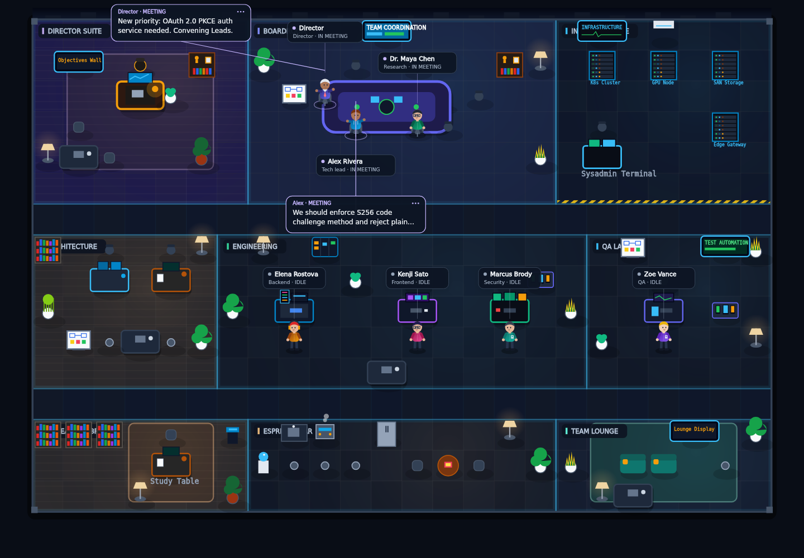

<p align="center">
  
</p>

<p align="center">
  <strong>Watch your AI agents work.</strong><br />
  A living virtual office for multi-agent observability, collaboration, token telemetry and costs.
</p>

<p align="center">
  <a href="https://github.com/jmmana/Agent-Viewer/actions/workflows/ci.yml"></a>
  
  
  <a href="LICENSE"></a>
  <a href="https://github.com/jmmana/Agent-Viewer/stargazers"></a>
</p>

<p align="center">
  <a href="#quickstart">Quickstart</a> ·
  <a href="#the-idea">The idea</a> ·
  <a href="#architecture">Architecture</a> ·
  <a href="#canonical-event-contract">Event Contract</a> ·
  <a href="#framework-compatibility">Frameworks</a> ·
  <a href="#python-and-typescript-sdks">SDKs</a> ·
  <a href="#embed-the-office-in-your-react-app">React Library</a> ·
  <a href="README.es.md">Español</a>
</p>

---

## Quickstart

Run both the frontend office interface (port 3000) and the backend event ingestion service (port 8787):

```bash
git clone https://github.com/jmmana/Agent-Viewer.git
cd Agent-Viewer
npm ci
npm run dev:full
```

Open **http://localhost:3000** in your browser. The office connects to the local streaming ingestion server at **http://localhost:8787**.

### Send a Test Event via cURL

In another terminal, push an event directly into the live office:

```bash
curl -X POST http://localhost:8787/api/v1/events \
  -H "Content-Type: application/json" \
  -d '{
    "schemaVersion": "1.0",
    "id": "evt_test_101",
    "type": "agent.message.sent",
    "timestamp": 1728345600000,
    "source": "cli",
    "agentId": "boss",
    "summary": "Carlos: Deployment completed successfully!",
    "payload": {
      "text": "Deployment completed successfully!"
    }
  }'
```

The character in the office will immediately display the speech card in real time!

---

## Embed the office in your React app

Agent Viewer is also a React library: `@warlockcode/agent-viewer` 0.2.0 (ES modules only, React and React DOM 19 as peer dependencies). The office is drawn only from the events you pass, never computes usage, and does not inject styles. Publication on npm is coming soon; until then, install it from the GitHub release:

```bash
npm install https://github.com/jmmana/Agent-Viewer/releases/download/v0.2.0/warlockcode-agent-viewer-0.2.0.tgz
```

```tsx
import { AgentOffice, type AgentProfile, type OfficeEventInput } from '@warlockcode/agent-viewer';
import '@warlockcode/agent-viewer/style.css';

const agents: AgentProfile[] = [
  { id: 'planner', name: 'Nova', roleTitle: 'Planner', workspace: 'leads_area' },
  { id: 'builder', name: 'Atlas', roleTitle: 'Builder', workspace: 'development' },
];
const events: OfficeEventInput[] = [
  { id: 'e1', type: 'agent.status.changed', timestamp: 1767225600000, source: 'agent:builder', agentId: 'builder', payload: { status: 'CODING' } },
  { id: 'e2', type: 'agent.message.sent', timestamp: 1767225601000, source: 'agent:planner', agentId: 'planner', payload: { text: 'Ship the parser first.', kind: 'proposal', targetAgentId: 'builder' } },
];

export function TeamOffice() {
  return <div style={{ height: 520 }}><AgentOffice agents={agents} events={events} /></div>;
}
```

Append new events to the array for live activity, or use `useEventReplay` and `ReplayControls` to replay a recorded run. Props, event mapping, translations, theming, usage rules and video export are covered in the [library guide](docs/library.md).

---

## The idea

**Agent Viewer turns multi-agent systems into an interactive living workplace you can understand at a glance.** Instead of wading through endless console logs or raw JSON dumps, you see your agents collaborate visually:
- Directors coordinate leaders in executive suites.
- Architects plan, delegating tasks to engineers at workstations.
- Agents collaborate in Meeting Rooms A & B.
- Model Ops NOC tracks tokens, latency and costs in real time.
- Idle agents grab coffee in the break room without altering authoritative work states.

### Key Tenets
1. **Authoritative Runtime Separation:** External agent frameworks remain authoritative. Ambient animation never overwrites real work status (`IDLE`, `THINKING`, `CODING`, etc.).
2. **Privacy First:** Only observable actions, tool names, and explicit messages are visualized. Private chain-of-thought is never required or exposed.
3. **Clean Live Mode:** When connected to live streaming runtimes, the UI boots cleanly with 0 seeded agents, 0 synthetic tokens, and no demo replay controls.

---

## Preview

<p align="center">
  
</p>

*Snapshot generated directly from the interactive Canvas 2.5D renderer.*

---

## Architecture

```
┌─────────────────────────────────────────────────────────────┐
│                       External Runtimes                     │
│  (LangGraph / CrewAI / AutoGen / Python SDK / TypeScript)   │
└──────────────┬──────────────────────────────┬───────────────┘
               │ HTTP POST /api/v1/events     │ Generic Webhook
               ▼                              ▼
┌─────────────────────────────────────────────────────────────┐
│            Agent Viewer Server (Express + Store)            │
│  - Canonical Contract V1 Validation (Zod)                   │
│  - In-Memory / SQLite Persistent Event Store                │
│  - Real-time Server-Sent Events (SSE) Broadcast Engine      │
└──────────────────────────────┬──────────────────────────────┘
                               │ SSE Stream /api/v1/events/stream
                               ▼
┌─────────────────────────────────────────────────────────────┐
│                 Agent Viewer Web Client / SPA               │
│  - HTML5 Canvas 2.5D Isomorphic Office Renderer             │
│  - Decoupled Presentation Motion & Ambient Engine           │
│  - Model Ops Token & Cost Telemetry Dashboard               │
│  - Throttled Session Persistence & Inspection Panels        │
└─────────────────────────────────────────────────────────────┘
```

---

## Canonical Event Contract

All events follow the canonical `1.0` envelope specification:

| Field | Type | Description |
|---|---|---|
| `schemaVersion` | `"1.0"` | Canonical schema version |
| `id` | `string` | Unique event ID (idempotency key) |
| `type` | `string` | Canonical event type (e.g. `agent.status.changed`) |
| `timestamp` | `number` | Unix epoch in milliseconds |
| `source` | `string` | Producer identifier (e.g. `runtime:crewai`) |
| `agentId` | `string?` | Optional agent identifier |
| `summary` | `string` | Human-readable log line (1–500 chars) |
| `payload` | `object` | Type-specific event details |

### Supported Event Types
- `agent.registered`: Introduce new agent with role, provider, model.
- `agent.status.changed`: Update work state (`IDLE`, `THINKING`, `CODING`, `TESTING`, `WAITING`, `BLOCKED`, `DONE`, `ERROR`).
- `agent.message.sent`: Display observable speech card with optional recipient.
- `tool.started` / `tool.completed` / `tool.failed`: Track tool calls and execution duration.
- `meeting.requested` / `meeting.started` / `meeting.ended`: Group discussions in rooms.
- `llm.usage`: Report token usage (input, output, cached, reasoning) and cost.

---

## Framework Compatibility

| Framework | Status | Integration Details |
|---|---|---|
| **Python SDK** | ✅ Production Ready | `agent-viewer` package (`sdk/python/`) |
| **TypeScript SDK** | ✅ Production Ready | Native TypeScript client (`sdk/typescript/`) |
| **Generic Webhooks** | ✅ Production Ready | `POST /api/v1/webhooks/generic` with HMAC SHA-256 |
| **LangGraph** | 🟢 Functional Adapter | Pre-built hook in `examples/langgraph-adapter.ts` |
| **CrewAI** | 🟢 Functional Adapter | Pre-built hook in `examples/crewai-adapter.py` |
| **AutoGen** | 🟢 Functional Adapter | Pre-built hook in `examples/autogen-adapter.py` |
| **OpenAI Swarm** | 🟡 Skeleton / Prototype | Sample mapping in `examples/swarm-adapter.py` |
| **Google GenAI ADK** | 🟡 Skeleton / Prototype | Sample mapping in `examples/google-adk-adapter.ts` |

---

## Python and TypeScript SDKs

### Python SDK
Install or include `sdk/python`:
```python
import os
from agent_viewer import AgentViewer

viewer = AgentViewer(url="http://localhost:8787", token=os.getenv("AGENT_VIEWER_API_TOKEN"))
agent = viewer.agent("analyst_1", name="Market Analyst", role_title="Financial Research")

agent.thinking("Analyzing quarterly bank filings")
agent.tool_started("sec_filing_fetcher", input_summary="Form 10-K")
agent.tool_completed("sec_filing_fetcher", output_summary="Retrieved 42 pages")
agent.usage("OpenAI", "gpt-4o", input_tokens=4200, output_tokens=320, cost=0.024)
agent.message("Completed financial overview!")
agent.done("Summary ready for review")
```

### TypeScript SDK
```typescript
import { AgentViewer } from './sdk/typescript';

const viewer = new AgentViewer({ url: 'http://localhost:8787' });
const agent = viewer.agent('coder_1', { name: 'DevBot', role: 'engineer' });

await agent.coding('Implementing REST webhook handlers');
await agent.usage({
  provider: 'Anthropic',
  model: 'claude-3-5-sonnet',
  inputTokens: 1800,
  outputTokens: 450,
  cost: 0.012,
});
await agent.done('Pull request opened');
```

---

## Controls

| Action | Control |
|---|---|
| Play / Pause Demo | Play button or **Space** |
| Step Forward | Step button while paused |
| Reset Session | Reset button in top bar |
| Pan Office | Drag canvas |
| Zoom | Mouse wheel or bottom HUD `+` / `-` |
| Maximize Viewport | Expand icon in bottom menu |
| Toggle Timeline | Bottom HUD button or "Show activity timeline" |
| Switch Views | **O** (Office) / **T** (Tasks) / **M** (Meetings) |

---

## Verification & Checks

```bash
# Typecheck
npm run lint

# Run all TypeScript & integration tests
npm test

# Run Python SDK live integration test suite
python3 tests/test_python_sdk.py

# Production build
npm run build
```

---

## Security

Please report vulnerabilities privately via [GitHub Security Advisories](https://github.com/jmmana/Agent-Viewer/security/advisories/new) or by emailing `jmmana@gmail.com`. See [SECURITY.md](SECURITY.md) for full configuration guidelines.

---

## Author & License

Created by **[Juan Manuel Castillo Pinto](https://github.com/jmmana)** · **WarlockCode**  
Released under the [MIT License](LICENSE).
