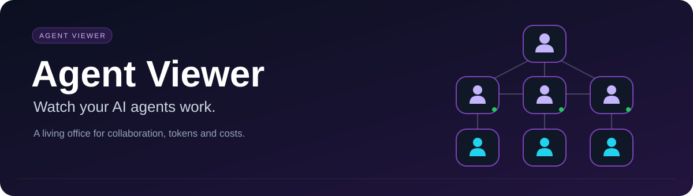
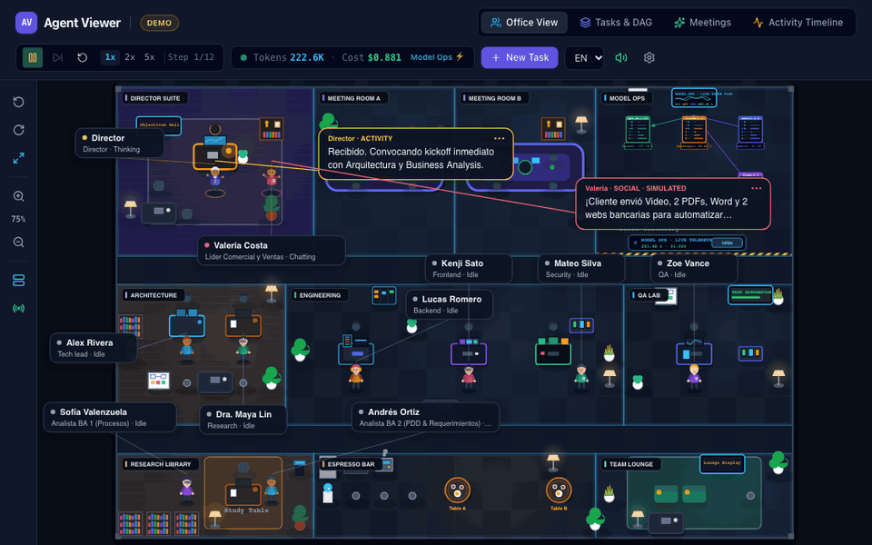
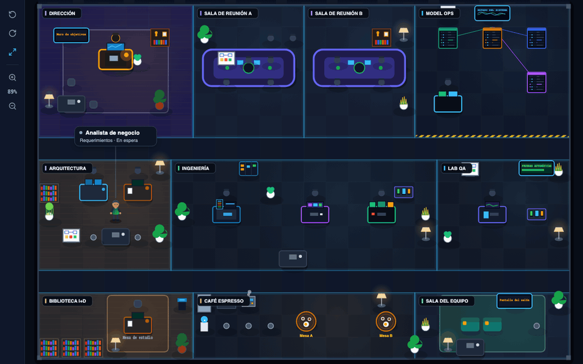
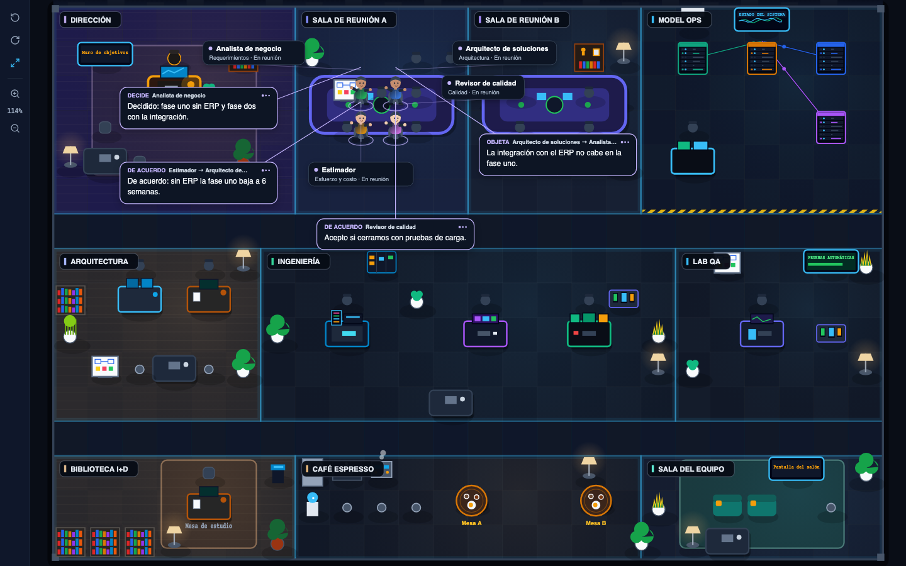
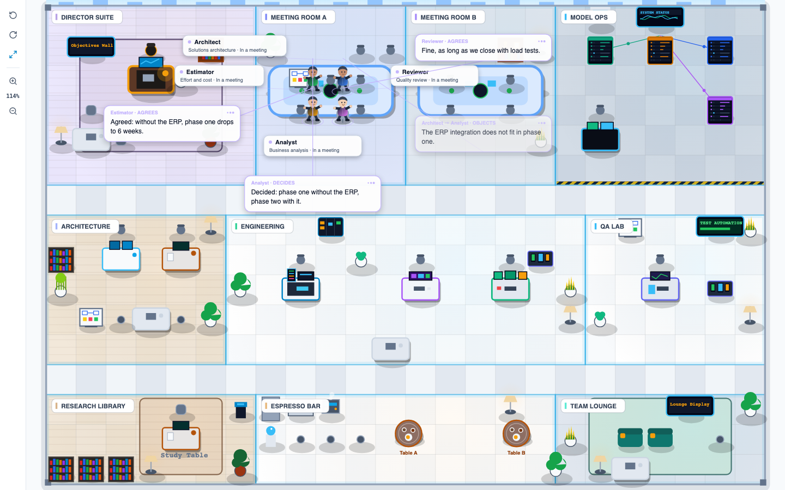
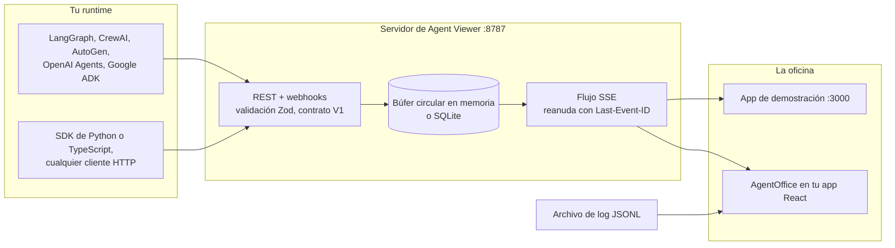

<!-- Encabezado -->
<p align="center">
  
</p>

<p align="center">
  <a href="#-inicio-rápido">
    
  </a>
</p>

<p align="center">
  <a href="https://github.com/jmmana/Agent-Viewer/actions/workflows/ci.yml"></a>
  <a href="../CHANGELOG.md"></a>
  <a href="../LICENSE"></a>
  <a href="https://github.com/jmmana/Agent-Viewer"></a>
  <a href="https://github.com/jmmana/Agent-Viewer/network/members"></a>
</p>

<p align="center">
  
  
  
  
  
  <a href="#-hoja-de-ruta"></a>
</p>

<p align="center">
  <a href="#-inicio-rápido"><b>Inicio rápido</b></a> ·
  <a href="#-integra-la-oficina-en-tu-app-react"><b>Integrar</b></a> ·
  <a href="#-conecta-tus-agentes"><b>Conectar agentes</b></a> ·
  <a href="#-contrato-de-eventos-v1"><b>Contrato de eventos</b></a> ·
  <a href="#-servidor-y-api"><b>API del servidor</b></a> ·
  <a href="#-hoja-de-ruta"><b>Hoja de ruta</b></a> ·
  <a href="../README.md"><b>English</b></a>
</p>

<p align="center">
  
</p>
<p align="center">
  <sub>La app de demostración (<code>npm run dev</code>) con su secuencia guionizada. Todos los agentes, frases y cifras de tokens de la demo son simulados. Integrada en tu app, la oficina dibuja solo lo que dicen tus eventos.</sub>
</p>

---

<h3 align="center">Tus agentes ya hablan entre ellos. Ahora puedes verlo.</h3>

Una ejecución multiagente es una conversación que no ves. El planificador delega, el programador llama herramientas, el revisor objeta, dos agentes se reúnen y toman una decisión, y tú solo tienes un muro de JSON pasando por la terminal. Algo se bloquea y te toca escarbar en los logs para saber quién esperaba a quién.

**Agent Viewer convierte ese flujo de eventos en una oficina viva.** Cada agente tiene su puesto, su estado y su tarjeta con el nombre. Las llamadas a herramientas aparecen en el momento en que ocurren. Los mensajes se vuelven burbujas encabezadas por lo que hacen: `PROPONE`, `OBJETA`, `ACUERDA`, `DECIDE`. Las reuniones llenan una sala y dejan decisiones. Quién trabaja, quién está bloqueado y quién habla con quién: de un vistazo.

Es código abierto (MIT), corre en tu máquina, no necesita ninguna clave de proveedores de modelos y se integra en cualquier app React 19 como un solo componente.

<table>
  <tr>
    <td align="center" width="25%"><h2>22</h2><sub>tipos de evento<br/>en el contrato V1</sub></td>
    <td align="center" width="25%"><h2>9</h2><sub>salas donde los agentes<br/>trabajan y se reúnen</sub></td>
    <td align="center" width="25%"><h2>ES · EN</h2><sub>116 claves de texto,<br/>todas reemplazables</sub></td>
    <td align="center" width="25%"><h2>0</h2><sub>cifras de consumo calculadas<br/>por el componente</sub></td>
  </tr>
</table>

---

## 🎯 Qué obtienes

| Pieza | Qué hace |
|---|---|
| 🏢 **Oficina viva** | Escena React + Canvas2D con 9 salas. Los agentes caminan a sus puestos y a las salas de reunión, muestran su estado y la herramienta que usan, y hablan con burbujas encabezadas por el tipo de mensaje. Gira, ajusta, desplaza, acerca y haz clic para seleccionar. |
| 🧩 **Librería integrable** | `@warlockcode/agent-viewer`: `<AgentOffice events={events} />` en cualquier app React 19. Modo profesional por defecto, CSS aislado con prefijo `av-`, español e inglés incluidos, controles de repetición y exportación de video. |
| 📡 **Servidor de ingesta** | API Express en el puerto 8787: ingesta individual y por lotes con idempotencia, flujo Server-Sent Events que se reanuda desde el último evento, webhook genérico con firma HMAC y almacenamiento en memoria o SQLite. |
| 🐍 **SDKs y adaptadores** | Clientes en Python y TypeScript, y adaptadores de ejemplo para LangGraph, CrewAI, AutoGen, OpenAI Agents SDK y Google ADK. |
| 🎬 **Repetición y exportación** | Carga un log JSONL V1, repítelo a su ritmo original con salto y velocidad, y grábalo en WebM o MP4 desde el navegador. |
| 📊 **Consola Model Ops** | En la app de demostración: tokens y costo reportado por proveedor y modelo, agregados a partir de los eventos `llm.usage`. |

## 🧠 Principios

Son reglas de diseño que el código cumple, no frases de marketing:

1. **Tu runtime manda.** Agent Viewer proyecta eventos; nunca decide qué está haciendo un agente. La animación jamás sobrescribe un estado de trabajo real (`IDLE`, `THINKING`, `CODING`...).
2. **Solo lo observable.** Estados, nombres de herramientas, mensajes explícitos, reuniones y consumo reportado. La cadena de pensamiento privada nunca se pide ni se muestra.
3. **Nada inventado en modo profesional.** La oficina integrada no tiene vida ambiental, ni frases inventadas, ni sonidos. El modo vitrina agrega vida de oficina simulada, y cada burbuja simulada lo dice (`SOCIAL · SIMULADO`).
4. **Desconocido no es cero.** El componente nunca calcula, suma ni pone precio al consumo. Un costo que falta se muestra como "desconocido", nunca como `0`.
5. **Un buen invitado en tu app.** No inyecta estilos, no usa selectores globales ni `localStorage`, no registra atajos de teclado globales y no ejecuta nada al importarse. Dos oficinas en la misma página nunca comparten estado.

**Lo que no es:** un backend de trazas, un almacén de logs ni un reemplazo de tu APM. Todavía no importa trazas OTLP, no llama a proveedores de modelos y los adaptadores de frameworks son ejemplos para adaptar, no integraciones empaquetadas. Mira la [tabla de madurez](#-conecta-tus-agentes).

---

## ⚡ Inicio rápido

### Un solo comando

```bash
npx @warlockcode/agent-viewer
```

Levanta el servidor de ingesta y la oficina juntos en `http://127.0.0.1:8787`, abre el navegador e imprime el token de la sesión y un comando `curl` que puedes pegar para que aparezca tu primer agente. Después, sin escribir JSON:

```bash
npx @warlockcode/agent-viewer send --agent demo --status working --message "Hola"
```

Las opciones (`--port`, `--host`, `--token`, `--demo`, `--no-open`, `--record run.jsonl`) están en la [guía de la CLI](cli.md) (en inglés). Para ejecutar la imagen Docker en esta máquina:

```bash
docker run --rm -p 127.0.0.1:8787:8787 \
  -e AGENT_VIEWER_API_TOKEN="$(openssl rand -base64 32)" \
  -v agent-viewer-data:/app/data \
  ghcr.io/jmmana/agent-viewer
```

Quita `127.0.0.1:` solo para acceder desde otros equipos, y hazlo detrás de TLS. Las opciones después del nombre de la imagen se suman a sus valores por defecto; las etiquetas y los tokens están en la [guía de la CLI](cli.md#docker). Mientras el paquete no esté en npm y la próxima versión no publique la imagen, ejecuta el `.tgz` de la versión con `npx ./warlockcode-agent-viewer-<versión>.tgz`.

### Mira trabajar a Claude Code

```bash
npx @warlockcode/agent-viewer install claude-code   # en tu proyecto; muestra el cambio y pregunta antes
```

Tus sesiones de Claude Code y sus subagentes aparecen en la oficina: herramientas, traspasos y cuándo Claude te espera. Solo viajan nombres de herramientas, tipos de agente, tiempos y estados; nunca argumentos, prompts, código ni rutas. La telemetría de tokens y costo es opcional, mediante `install claude-code --telemetry`; sin ella, la promesa anterior se cumple tal cual está escrita. Instalación, privacidad y desinstalación: [claude-code.md](claude-code.md) (en inglés).

### Desde el repositorio

Para trabajar en el repositorio necesitas Node.js 24 o superior. Las apps que solo instalan la librería necesitan React 19, nada más.

```bash
git clone https://github.com/jmmana/Agent-Viewer.git
cd Agent-Viewer
npm ci
npm run dev:full   # servidor de ingesta en :8787 + oficina en :3000 en modo en vivo
```

| Comando | Abre | Qué ves |
|---|---|---|
| `npm run dev:full` | **http://localhost:3000** | Modo en vivo: una oficina vacía (sin agentes precargados ni tokens sintéticos) conectada al servidor del puerto 8787. Los eventos que envíes aparecen de inmediato. |
| `npm run dev` | **http://localhost:3000** | La demo: la oficina viva completa con un equipo simulado y datos simulados. Pulsa **Espacio** (o Play) para correr la secuencia de demostración. Agrega `?mode=live` (o define `VITE_AGENT_VIEWER_MODE=live`) para pasarla a modo en vivo. |

### Envía tus primeros eventos

Con `npm run dev:full` corriendo, envía esto desde otra terminal y míralo llegar:

```bash
# 1. Una planificadora entra a la oficina y se sienta en Arquitectura
curl -X POST http://localhost:8787/api/v1/events \
  -H "Content-Type: application/json" \
  -d '{
    "schemaVersion": "1.0",
    "id": "evt_hola_1",
    "type": "agent.registered",
    "timestamp": 1767225600000,
    "source": "cli",
    "agentId": "nova",
    "summary": "Nova entra a la oficina",
    "payload": { "name": "Nova", "roleTitle": "Planificadora", "workspace": "leads_area" }
  }'

# 2. Nova propone algo: una burbuja encabezada "PROPONE" si la oficina está en español
curl -X POST http://localhost:8787/api/v1/events \
  -H "Content-Type: application/json" \
  -d '{
    "schemaVersion": "1.0",
    "id": "evt_hola_2",
    "type": "agent.message.sent",
    "timestamp": 1767225601000,
    "source": "cli",
    "agentId": "nova",
    "summary": "Nova propone un plan",
    "payload": { "text": "Primero el parser y después el exportador.", "kind": "proposal" }
  }'
```

¿No tienes el sobre a mano? El webhook genérico recibe un cuerpo plano y arma los eventos por ti:

```bash
curl -X POST http://localhost:8787/api/v1/webhooks/generic \
  -H "Content-Type: application/json" \
  -d '{ "agent": "atlas", "status": "coding", "message": "Escribiendo el parser", "tool": "editor" }'
```

### O con Docker

```bash
docker compose -f docker/compose.yml up --build
```

Levanta la API en **:8787** con SQLite en un volumen con nombre, y la demo compilada en **:3000**. Compose publica ambos puertos solo en `127.0.0.1`. Para acceder a la oficina desde otros equipos, restaura los mapeos `"8787:8787"` y `"3000:3000"`, actualiza `AGENT_VIEWER_CORS_ORIGIN` y `VITE_AGENT_VIEWER_API_URL`, y pon los servicios detrás de TLS. La API nunca corre sin token: define `AGENT_VIEWER_API_TOKEN` antes de `up` para elegirlo, o lee el que genera con `docker compose -f docker/compose.yml logs api`. Luego abre **http://localhost:3000/?mode=live#token=&lt;token&gt;** para ver el flujo (la oficina quita el token de la barra de direcciones en cuanto lo lee).

> **Mantenedores:** GitHub Container Registry crea el paquete `ghcr.io/jmmana/agent-viewer` como privado, y el flujo de publicación no puede cambiarlo. Después de la primera versión que lo publique, hazlo público una vez en la página del paquete: **Package settings > Danger Zone > Change visibility > Public**. El resumen de la ejecución de la publicación muestra la visibilidad actual.

---

## 🧩 Integra la oficina en tu app React

<p align="center">
  
</p>
<p align="center">
  <sub><code>&lt;AgentOffice locale="es" /&gt;</code> en modo profesional: una reunión donde los agentes proponen, objetan, acuerdan y deciden. Solo se dibujan los eventos que recibe el componente.</sub>
</p>

Agent Viewer también es una librería React: **`@warlockcode/agent-viewer` 0.2.1**. Solo módulos ES, React y React DOM 19 como dependencias peer, `express`, `lucide-react` y `zod` como dependencias de ejecución (con `express` corre el servidor del comando `agent-viewer`; los módulos de la librería nunca lo importan), y declaraciones de TypeScript incluidas.

La publicación en npm llegará muy pronto. Mientras tanto, instálala desde el archivo de la release de GitHub (el nombre del paquete y tus imports no cambian cuando pases a npm):

```bash
npm install https://github.com/jmmana/Agent-Viewer/releases/download/v0.2.1/warlockcode-agent-viewer-0.2.1.tgz
```

### Ejemplo mínimo

```tsx
import { AgentOffice, type AgentProfile, type OfficeEventInput } from '@warlockcode/agent-viewer';
import '@warlockcode/agent-viewer/style.css';

// Definidos fuera del componente, así los arreglos conservan la misma identidad en cada render.
const agents: AgentProfile[] = [
  { id: 'planner', name: 'Nova', roleTitle: 'Planificadora', workspace: 'leads_area', avatarColor: '#38bdf8' },
  { id: 'builder', name: 'Atlas', roleTitle: 'Desarrollador', workspace: 'development', avatarColor: '#f472b6' },
];

const events: OfficeEventInput[] = [
  {
    schemaVersion: '1.0',
    id: 'evt-001',
    type: 'agent.status.changed',
    timestamp: 1767225600000,
    source: 'agent:builder',
    agentId: 'builder',
    summary: 'Atlas empieza a programar',
    payload: { status: 'CODING', statusText: 'Escribiendo el parser' },
  },
  {
    schemaVersion: '1.0',
    id: 'evt-002',
    type: 'agent.message.sent',
    timestamp: 1767225601000,
    source: 'agent:planner',
    agentId: 'planner',
    summary: 'Nova propone un orden',
    payload: { text: 'Primero el parser y después el exportador.', kind: 'proposal', targetAgentId: 'builder' },
  },
];

export function OficinaDelEquipo() {
  return (
    <div style={{ height: 520 }}>
      <AgentOffice agents={agents} events={events} locale="es" theme="dark" />
    </div>
  );
}
```

Atlas aparece en un puesto de Ingeniería con el estado "Programando". Nova aparece en Arquitectura con una burbuja encabezada `Nova → Atlas · PROPONE` durante 6,5 segundos. La oficina ocupa todo su contenedor (con al menos 320 px de alto), así que dale una altura al contenedor.

### Eventos en vivo

`<AgentOffice>` se controla con `events`: agrega cada evento nuevo y pasa el arreglo nuevo. Los eventos pueden venir de cualquier parte (tu WebSocket, un store, un sondeo periódico). `connectEventStream` es una ayuda para el flujo SSE de un servidor de Agent Viewer:

```tsx
import { useEffect, useState } from 'react';
import { AgentOffice, connectEventStream, type OfficeEventInput } from '@warlockcode/agent-viewer';

export function OficinaEnVivo() {
  const [events, setEvents] = useState<OfficeEventInput[]>([]);

  useEffect(() => {
    const connection = connectEventStream('http://localhost:8787', (event) => {
      setEvents((list) => [...list, event]);
    });
    return () => connection.close();
  }, []);

  return (
    <div style={{ height: 600 }}>
      <AgentOffice events={events} locale="es" />
    </div>
  );
}
```

Dale a cada evento un `id` estable y único: la oficina ignora los ids que ya aplicó. Pasa un arreglo nuevo cuando cambien los eventos (modificar el mismo arreglo no se detecta), y mantén estables `agents`, `messages` y `t` entre renders.

### Dos modos

| Modo | Qué muestra la oficina |
|---|---|
| `professional` (por defecto) | Solo lo que dicen los eventos. Sin vida ambiental, sin frases inventadas, sin segundo piso oculto y sin sonidos. Cuando se pide una reunión, los participantes solo caminan a la sala. |
| `showcase` (vitrina) | Agrega vida de oficina simulada para demos: los agentes inactivos van por café y charlan en conversaciones cortas simuladas, encabezadas `SOCIAL · SIMULADO`. Nunca cambian el estado de trabajo de un agente. |

### Oscuro o claro, español o inglés

<table>
  <tr>
    <th align="center" width="50%">Oscuro · español</th>
    <th align="center" width="50%">Claro · inglés</th>
  </tr>
  <tr>
    <td></td>
    <td></td>
  </tr>
  <tr>
    <td align="center"><code>theme="dark" locale="es"</code></td>
    <td align="center"><code>theme="light" locale="en"</code></td>
  </tr>
</table>

Todo texto visible sale de un catálogo de 116 claves. Cambia el nombre de una sala con `messages`, o conecta i18next o FormatJS con `t`. Las propiedades CSS `--av-*` cambian el estilo de la barra de herramientas y los paneles con especificidad cero.

### Accesible desde el inicio

- Una lista en vivo (anunciada con cortesía) de cada agente con su rol y su estado. Se abre al recibir el foco del teclado (**Tab**), y cada agente es un botón que lo selecciona y mueve la cámara hacia él.
- Un canvas con nombre accesible, una barra de herramientas con botones reales y un anillo de foco visible.
- Con `prefers-reduced-motion: reduce` nada se anima: los agentes llegan a su destino sin caminar.

<details>
<summary><b>📦 Todo lo que exporta el paquete</b></summary>
<br/>

| Área | Valores |
|---|---|
| Oficina | `AgentOffice` |
| Modelo de la oficina sin React | `OfficeStore`, `buildOfficeSnapshot` |
| Repetición | `useEventReplay`, `ReplayControls` |
| Consumo (solo visualización) | `formatUsage`, `formatTokens`, `formatCost`, `summarizeUsage` |
| Textos | `OFFICE_MESSAGES`, `createOfficeTranslator`, `formatMessage`, `builtInMessages`, `isOfficeMessageKey` |
| Contrato de eventos V1 | `SCHEMA_VERSION`, `CANONICAL_EVENT_TYPES`, `EVENT_TYPE_ALIASES`, `MESSAGE_KINDS`, `isMessageKind`, `LLM_ERROR_KINDS`, `isLlmErrorKind`, `normalizeCanonicalEvent`, `validateCanonicalEvent` |
| Flujo en vivo | `connectEventStream` |
| Archivos de log | `parseEventLog`, `MAX_EVENT_LOG_SIZE_BYTES` |
| Video | `recordReplay`, `computeReplaySchedule`, `isRecordingSupported`, `getSupportedMimeType` |

Todos traen sus tipos. La hoja de estilos es `@warlockcode/agent-viewer/style.css`.

</details>

<details>
<summary><b>⏯️ Repite una ejecución grabada</b></summary>
<br/>

`useEventReplay` reproduce una ejecución a su propio ritmo y devuelve el tramo visible. Solo revela eventos; nunca crea ninguno.

```tsx
import { AgentOffice, ReplayControls, useEventReplay, type OfficeEventInput } from '@warlockcode/agent-viewer';

export function RepeticionDeEjecucion({ run }: { run: readonly OfficeEventInput[] }) {
  const replay = useEventReplay(run, { speed: 2, maxGapMs: 3000 });

  return (
    <div style={{ display: 'grid', gridTemplateRows: '1fr auto', gap: 8, height: 600 }}>
      <AgentOffice events={replay.events} locale="es" />
      <ReplayControls replay={replay} speeds={[1, 2, 4, 8]} locale="es" />
    </div>
  );
}
```

Carga un log JSONL V1 con `parseEventLog(file)` (hasta 25 MB; las líneas inválidas se reportan sin detener la lectura) y pasa `result.events` como ejecución. Expórtala a video con `recordReplay({ events, speed: 4 })`, que dibuja en su propio canvas fuera de pantalla.

</details>

<details>
<summary><b>💰 Muestra cifras de consumo (calculadas por ti)</b></summary>
<br/>

```tsx
import { useMemo } from 'react';
import { AgentOffice, type OfficeEventInput, type OfficeUsage } from '@warlockcode/agent-viewer';

export function OficinaConConsumo({ events }: { events: readonly OfficeEventInput[] }) {
  const usage = useMemo<OfficeUsage>(() => ({
    total: { totalTokens: 18400, inputTokens: 15200, outputTokens: 3200, cost: 0.42, currency: 'USD' },
    byAgent: {
      planner: { totalTokens: 6100, cost: null },
      builder: { totalTokens: 12300, cost: 0.42, currency: 'USD' },
    },
  }), []);

  return (
    <div style={{ height: 520 }}>
      <AgentOffice events={events} locale="es" showUsage usage={usage} />
    </div>
  );
}
```

`showUsage` viene apagado. Un valor que falta se muestra como "desconocido", nunca como cero. ¿No tienes un servicio de consumo? `summarizeUsage(events)` es una ayuda opcional y explícita que solo suma lo que reportaron los eventos `llm.usage`: ignora los ids de evento repetidos, deja como desconocido un conteo de tokens que un evento no reporta y devuelve un costo desconocido antes que una suma parcial o una suma de monedas mezcladas o ausentes.

</details>

**Guía completa:** props, efecto de cada evento, espacios de trabajo, traducciones, temas, reglas de consumo, repetición, exportación de video y el store sin React están en la [guía de la librería](library.es.md) ([English](library.md)).

---

## 🏢 Dentro de la oficina

Cada agente se sienta en la sala que indica su `workspace`. Los identificadores de sala son valores estables de la API; sus etiquetas se traducen.

| `workspace` | Sala | Ideal para |
|---|---|---|
| `boss_office` | DIRECCIÓN | Orquestación, escalamiento y decisiones. Sala de reunión de respaldo. |
| `leads_area` | ARQUITECTURA | Planeación, delegación y revisión técnica. |
| `development` | INGENIERÍA | Programación, implementación y ejecución de herramientas. |
| `qa_lab` | LAB QA | Pruebas y validación. |
| `research_area` | BIBLIOTECA I+D | Investigación, recuperación de información y análisis de documentos. |
| `server_room` | MODEL OPS | Telemetría de proveedores, modelos y tokens. |
| `meeting_room` | SALA DE REUNIÓN A | Reuniones, 4 puestos. |
| `meeting_room_b` | SALA DE REUNIÓN B | Reuniones adicionales, 4 puestos. |
| `break_room` | CAFÉ ESPRESSO | Tiempo libre. Café y charla en modo vitrina. |

**Las burbujas dicen qué hace cada mensaje.** Pasa un `kind` en `agent.message.sent` (o `type` en `meeting.message`) y la burbuja dice `Hablante → Destino · ENCABEZADO`:

| Tipo | Encabezado en español | Encabezado en inglés |
|---|---|---|
| `statement` | DICE | SAYS |
| `proposal` | PROPONE | PROPOSES |
| `question` | PREGUNTA | ASKS |
| `answer` | RESPONDE | ANSWERS |
| `objection` | OBJETA | OBJECTS |
| `critique` | CRITICA | CRITIQUES |
| `agreement` | ACUERDA | AGREES |
| `summary` | RESUME | SUMMARIZES |
| `decision` | DECIDE | DECIDES |

La oficina nunca adivina el tipo. Una `decision` dentro de una reunión también queda registrada en las decisiones de la reunión.

<details>
<summary><b>🚦 Los 23 estados de un agente</b></summary>
<br/>

`OFFLINE`, `IDLE`, `AVAILABLE`, `THINKING`, `READING`, `RESEARCHING`, `CODING`, `WRITING`, `TESTING`, `USING_TOOL`, `WAITING`, `WAITING_APPROVAL`, `BLOCKED`, `DELEGATING`, `PHONE_CALL`, `WALKING`, `IN_MEETING`, `COFFEE_BREAK`, `CHATTING`, `REVIEWING`, `DELIVERING`, `DONE`, `ERROR`.

En los eventos no importan mayúsculas o minúsculas; los estados desconocidos se ignoran. `tool.started` pone `USING_TOOL`, `tool.failed` pone `ERROR`, y una reunión solicitada pone `WALKING` y luego `IN_MEETING`. En pantalla se ven traducidos ("Programando", "Bloqueado", "En reunión"...).

</details>

---

## 🔌 Conecta tus agentes

Madurez honesta, para que sepas qué te llevas:

| Integración | Dónde | Madurez |
|---|---|---|
| **API REST, lotes, SSE** | [`server/`](../server/index.ts) | ✅ **Estable.** Cubierta por pruebas de integración, de SSE y de seguridad del webhook en CI. |
| **Claude Code** | [`agent-viewer install claude-code`](claude-code.md) | ✅ **Estable.** Hooks oficiales de Claude Code: sesiones, subagentes como agentes propios, herramientas y esperas. Pruebas con fixtures de cada tipo de hook demuestran que no salen argumentos ni contenido. |
| **CLI** | [`npx @warlockcode/agent-viewer`](cli.md) | ✅ **Estable.** Servidor y oficina en un comando, y `send` para eventos rápidos. Prueba de punta a punta en CI. |
| **Webhook genérico** | `POST /api/v1/webhooks/generic` | ✅ **Estable.** Cuerpo plano, firma HMAC-SHA256 opcional con ventana anti repetición de 5 minutos. |
| **SDK de Python** | [`sdk/python/`](../sdk/python/agent_viewer.py) | ✅ **Estable.** Solo biblioteca estándar, probado contra un servidor real en CI. Todavía no está en PyPI. |
| **SDK de TypeScript** | [`sdk/typescript/`](../sdk/typescript/index.ts) | ✅ **Estable.** Probado en CI. Aún no es un paquete aparte: impórtalo desde una copia del repositorio. |
| **Repetición de logs JSONL** | [`parseEventLog`](event-log.md) | ✅ **Estable.** API de la librería, y arrastrar y soltar en la app de demostración. |
| **LangGraph** | [`examples/langgraph-adapter.ts`](../examples/langgraph-adapter.ts) | 🧪 **Adaptador de ejemplo.** Callbacks de nodos, herramientas y consumo traducidos a llamadas del SDK. Verificado con el compilador en CI, no ejecutado contra LangGraph. |
| **CrewAI** | [`examples/crewai-adapter.py`](../examples/crewai-adapter.py) | 🧪 **Adaptador de ejemplo.** Agentes de la crew, tareas, herramientas, mensajes y consumo. No se ejecuta en CI. |
| **AutoGen** | [`examples/autogen-adapter.py`](../examples/autogen-adapter.py) | 🧪 **Adaptador de ejemplo.** Agentes conversables y mensajes del group chat, herramientas y consumo. No se ejecuta en CI. |
| **OpenAI Agents SDK** | [`examples/openai-agents-adapter.ts`](../examples/openai-agents-adapter.ts) | 🧪 **Adaptador de ejemplo.** Ejecuciones de agentes, traspasos (handoffs), herramientas y consumo. Verificado con el compilador en CI. |
| **Google ADK** | [`examples/google-adk-adapter.ts`](../examples/google-adk-adapter.ts) | 🧪 **Adaptador de ejemplo.** Turnos de Gemini, llamadas a funciones y consumo. Verificado con el compilador en CI. |
| **Trazas OTLP** | ninguno | ❌ **Todavía no.** `parseEventLog` lo dice en vez de adivinar. Está en la [hoja de ruta](#-hoja-de-ruta). |

<sub>✅ estable y probado · 🧪 código de ejemplo que conectas a los callbacks del framework (los adaptadores no importan los frameworks) · ❌ no disponible</sub>

Todos los adaptadores respetan la misma frontera de confianza: de tu runtime solo salen estados observables, mensajes y consumo reportado. Nunca envíes claves de API ni prompts de sistema privados por el flujo de eventos.

### SDK de Python

Un solo módulo sin dependencias de terceros. Instálalo desde un clon con `pip install ./sdk/python` (o copia `agent_viewer.py` a tu proyecto):

```python
import os
from agent_viewer import AgentViewer

viewer = AgentViewer(url="http://localhost:8787", token=os.getenv("AGENT_VIEWER_API_TOKEN"), runtime_id="mi-crew")
analista = viewer.agent("analyst", name="Iris", role_title="Analista de mercado", workspace="research_area")

analista.researching("Leyendo los informes trimestrales")
analista.tool_started("lector_de_informes", input_summary="Formulario 10-K")
analista.tool_completed("lector_de_informes", output_summary="42 páginas recuperadas")
analista.usage("OpenAI", "gpt-4o", input_tokens=4200, output_tokens=320, cost=0.024, cost_source="provider-reported", currency="USD")
analista.message("El resumen está listo para revisión.", target_agent_name="Nova")
analista.done("Resumen entregado")
```

El agente se registra solo en su primera llamada. Las peticiones se reintentan con espera creciente, y `usage()` sin `cost` lo reporta como desconocido. Los tokens que no envías siguen desconocidos, nunca `0`. El SDK nunca supone `provider-reported`: un `cost` sin `cost_source` se envía como `unknown`, con un solo aviso por cliente. Los reintentos de transporte reutilizan el mismo id de evento y el mismo `requestId`. Si tu código vuelve a llamar a `usage()` para la misma llamada al proveedor, pasa el mismo `requestId` y el servidor guarda una sola copia.

### SDK de TypeScript

```ts
import { AgentViewer } from './sdk/typescript/index';

const viewer = new AgentViewer({ url: 'http://localhost:8787', apiKey: process.env.AGENT_VIEWER_API_TOKEN, runtimeId: 'mi-crew' });
const builder = viewer.agent({ id: 'builder', name: 'Atlas', roleTitle: 'Desarrollador', workspace: 'development' });

await builder.coding('Implementando el manejador del webhook');
await builder.toolStarted('npm.test', 'pruebas unitarias');
await builder.toolCompleted('npm.test', '128 aprobadas');
await builder.usage({ provider: 'Anthropic', model: 'claude-sonnet-4-5', inputTokens: 1800, outputTokens: 450, cost: 0.012, costSource: 'provider-reported', currency: 'USD' });
await builder.message('El manejador está listo para revisión.', 'Nova');
await builder.done('Pull request abierto');
```

Varias crews pueden compartir un servidor: marca cada cliente con su propio `runtimeId` y `sessionId`, y filtra con `GET /api/v1/events?runtimeId=...`. Más detalles en la [guía de integración](integration.md) (en inglés). Los reintentos de transporte reutilizan el mismo id de evento y el mismo `requestId`. Si tu código vuelve a llamar a `usage()` para la misma llamada al proveedor, pasa el mismo `requestId` y el servidor guarda una sola copia.

---

## 📜 Contrato de eventos V1

Un solo sobre para todo. Los productores lo envían, el servidor lo valida con Zod y la oficina lo dibuja.

```json
{
  "schemaVersion": "1.0",
  "id": "evt_1791190800000_abc123",
  "type": "agent.status.changed",
  "timestamp": 1791190800000,
  "runtimeId": "crewai-production",
  "sessionId": "run-2026-001",
  "source": "agent:researcher",
  "agentId": "researcher",
  "taskId": "task_01",
  "severity": "normal",
  "summary": "Research started",
  "payload": { "status": "RESEARCHING", "workspace": "research_area" }
}
```

| Campo | Tipo | Descripción |
|---|---|---|
| `schemaVersion` | `"1.0"` | Versión del contrato. |
| `id` | `string` | Id único del evento; también es la clave de idempotencia. Un id nombra exactamente un evento: reutilizarlo con otro contenido se rechaza con 409. |
| `type` | `string` | Uno de los 22 tipos canónicos (se aceptan alias). |
| `timestamp` | `number` | Época Unix en milisegundos. |
| `source` | `string` | Quién lo produce, por ejemplo `runtime:crewai` o `agent:researcher`. |
| `agentId` | `string?` | El agente del que habla el evento. |
| `runtimeId`, `sessionId`, `taskId` | `string?` | Agrupación por runtime, sesión y tarea. |
| `severity` | `string?` | `low`, `normal` (por defecto), `high` o `critical`. |
| `summary` | `string` | Línea legible para personas, no vacía. |
| `payload` | `object` | Detalle propio de cada tipo. |

<details>
<summary><b>📋 Los 22 tipos de evento y qué hacen en la oficina</b></summary>
<br/>

| Categoría | Tipo | Efecto |
|---|---|---|
| Agente | `agent.registered` | Agrega el agente (nombre, rol, equipo, sala, color, proveedor, modelo). |
| | `agent.updated` | Actualiza el perfil; un `workspace` válido se vuelve su nuevo puesto. |
| | `agent.status.changed` | Cambia el estado; el agente solo se mueve si llega un `workspace`. |
| | `agent.message.sent` | Burbuja de diálogo, con `kind` y destinatario opcionales (una línea punteada une a ambos agentes). |
| Tareas | `task.created`, `task.assigned`, `task.progress` | Se registran. |
| | `task.completed`, `task.failed`, `task.blocked` | `DONE`, `ERROR` o `BLOCKED` para el agente que la trabaja. |
| Herramientas | `tool.started`, `tool.completed`, `tool.failed` | `USING_TOOL`, y después `IDLE` o `ERROR`. |
| Reuniones | `meeting.requested` | Reserva la primera sala libre; los participantes caminan hasta allí y la reunión empieza cuando llegan todos. |
| | `meeting.started` | Empieza de inmediato. |
| | `meeting.message` | Burbuja encabezada por su tipo; una `decision` se suma a las decisiones de la reunión. |
| | `meeting.ended`, `meeting.cancelled` | Libera la sala; los participantes vuelven caminando a su puesto. |
| Telemetría | `llm.usage` | Proveedor, modelo, tokens de entrada y salida, tokens leídos y escritos en caché, tokens de razonamiento, latencia, costo, origen del costo y moneda. Una cifra que no se reportó queda como desconocida, nunca como 0. |
| | `llm.failed` | Un intento fallido de llamada al modelo: proveedor, modelo, tipo de error, estado HTTP y si se puede reintentar. Tokens y costo solo cuando el proveedor cobró el intento. Sin cambio de estado. |
| Runtime | `runtime.connected`, `runtime.disconnected`, `runtime.heartbeat` | Salud del runtime; sin cambio visible. |

Los alias como `message.sent`, `meeting.decision` o `approval.requested` se traducen a su tipo canónico. La tabla completa de efectos está en la [guía de la librería](library.es.md#cómo-cambian-la-oficina-los-eventos), y el esquema en [`canonicalContract.ts`](../src/integrations/canonicalContract.ts).

</details>

**Regla de consumo:** reporta `cost` cuando el proveedor lo entrega (`costSource: "provider-reported"`). Si no lo sabes, envía `null` con `costSource: "unknown"`: seguirá siendo desconocido hasta la pantalla. Los SDK nunca suponen `provider-reported`: un costo enviado sin `costSource` declarado sale como `unknown`. Los logs usan el mismo sobre, un evento por línea: mira [event-log.md](event-log.md) (en inglés).

---

## 📡 Servidor y API



| Método | Endpoint | Para qué |
|---|---|---|
| `GET` | `/health` | Estado, versión, versión del esquema, clientes SSE conectados y modos actuales `auth` / `webhookAuth`. |
| `GET` | `/ready` | Disponibilidad del almacenamiento y los contadores `ingestion` (conflictos rechazados y filas antiguas que coincidieron solo por id). SQLite también devuelve la versión del esquema y la hora de la última migración. |
| `POST` | `/api/v1/events` | Ingesta de un evento. Respeta el encabezado `Idempotency-Key`. Un reintento real es un duplicado `200`; el mismo id con otro contenido es un `409`. |
| `POST` | `/api/v1/events/batch` | Ingesta de hasta 100 eventos (configurable). Cada elemento informa `accepted`, `duplicate` o `conflict`; solo los aceptados se guardan y se transmiten. |
| `GET` | `/api/v1/events` | Consulta con `limit`, `since`, `afterId`, `runtimeId`, `sessionId`, `agentId`, `type`. |
| `GET` | `/api/v1/events/stream` | Server-Sent Events. Reenvía los eventos perdidos desde `Last-Event-ID`; latido cada 15 s. |
| `GET` | `/api/v1/snapshot` | Foto agregada: agentes, tareas, reuniones, runtimes y el bloque `usage`. Los campos obsoletos `totalCost` y `cost` de cada agente son `null` salvo que todas las llamadas reporten una sola moneda conocida (una moneda, un origen de costo). |
| `GET` | `/api/v1/usage` | Solo los agregados de consumo, llamada por llamada: por agente y por `(provider, model)`, con los conteos de lo desconocido y los costos por moneda, nunca sumados entre monedas. [Detalles](integration.md#usage-aggregates-get-apiv1usage) (en inglés). |
| `POST` | `/api/v1/agents` | Registra o actualiza un agente. |
| `PATCH` | `/api/v1/agents/:agentId` | Actualiza el perfil o el estado de un agente (solo campos descriptivos; el uso se reporta con `llm.usage`). |
| `POST` / `GET` | `/api/v1/runtimes` | Registra un runtime (latido) / lista los runtimes. |
| `GET` | `/api/v1/sessions`, `/api/v1/sessions/:sessionId` | Lista las sesiones / muestra una con sus eventos. |
| `POST` | `/api/v1/webhooks/generic` | Webhook plano: `agent`, `status`, `message`, `tool`, `usage`. |

**Campos PATCH del agente:** `name`, `roleTitle`, `provider` y `model` emiten `agent.updated`. `status` emite `agent.status.changed`; `statusText` y `workspace` acompañan ese evento cuando se incluye `status`, y en caso contrario emiten `agent.updated`. Los valores deben ser cadenas: los campos del perfil y `workspace` se recortan y deben tener entre 1 y 200 caracteres; `statusText`, entre 0 y 1000; y `status` debe ser un estado conocido. Se rechazan los demás campos. No se pueden modificar campos de uso como `tokensInput`, `inputTokens`, `cachedTokens`, `cost`, `currency` y `latencyMs`. Reporta el uso con un evento `llm.usage` en `POST /api/v1/events` o con la función auxiliar `usage()` del SDK.

Por ejemplo, un campo de uso devuelve HTTP 400:

```json
{
  "error": "validation_failed",
  "message": "Usage and cost cannot be edited through PATCH. Send an llm.usage event to POST /api/v1/events (or use the SDK usage() helper) so the spend is recorded and auditable.",
  "issues": [{ "path": "cost", "code": "usage_not_patchable", "message": "Report cost with an llm.usage event." }]
}
```

<details>
<summary><b>🧾 Validación, idempotencia y respuestas por lotes</b></summary>
<br/>

Un evento inválido recibe HTTP 400 con las rutas exactas que fallaron:

```json
{
  "error": "validation_failed",
  "issues": [{ "path": "payload.inputTokens", "message": "Expected non-negative integer" }]
}
```

El id del evento es la clave de idempotencia, y el contenido decide qué significa un id repetido. El servidor compara una huella `fingerprint` (`sha256:` sobre el evento validado, con las claves ordenadas y los valores por defecto ya puestos) con la que guardó:

| Guardado | Recibido | Respuesta | Efecto |
|---|---|---|---|
| ningún evento con ese id | cualquiera | `202` aceptado | Se guarda, se agrega y se transmite. |
| mismo id, mismo contenido | | `200` duplicado | No cambia nada. Es un reintento real. |
| mismo id, otro contenido | | `409 conflicting_duplicate` | No se guarda, no se agrega ni se transmite. El evento guardado queda como estaba. |

El primer envío devuelve `202` con la huella, y un reintento real devuelve HTTP 200 con la misma huella en lugar de guardar una segunda copia:

```json
{ "accepted": true, "duplicate": true, "duplicateReason": "event_id", "id": "evt_req_9921", "fingerprint": "sha256:3f1c..." }
```

El mismo id con cualquier campo guardado distinto (un conteo de tokens, el costo, un costo que era `0` y ahora falta, o el `timestamp`) se rechaza con HTTP 409:

```json
{
  "error": "conflicting_duplicate",
  "message": "An event with id \"evt_req_9921\" was already stored with different content. The new event was not applied.",
  "id": "evt_req_9921",
  "fingerprint": "sha256:9b0e...",
  "storedFingerprint": "sha256:3f1c..."
}
```

Un reintento debe reenviar el evento idéntico, con el mismo `timestamp`; rehacer el cuerpo con un `Date.now()` nuevo es otro evento. Da a cada evento distinto su propio id. Un alias de tipo que la validación resuelve al tipo canónico es el mismo evento, así que es un duplicado.

Si se envían el encabezado `Idempotency-Key` y un `id` no vacío en el cuerpo y no coinciden, no se guarda nada y la respuesta es HTTP 400. Un encabezado sin `id` en el cuerpo se usa como id, como antes:

```json
{ "error": "idempotency_key_mismatch", "message": "Idempotency-Key \"a\" does not match the event id \"b\"." }
```

Un lote responde `202` siempre que la validación pase, aunque no se haya aplicado ningún elemento, así que lee `conflicts` y el `status` de cada elemento (en el orden de entrada). Cada elemento se compara con lo guardado y con los elementos anteriores del mismo lote:

```json
{
  "accepted": 1,
  "duplicates": 1,
  "conflicts": 1,
  "total": 3,
  "results": [
    { "id": "evt_b1", "status": "accepted",  "duplicate": false, "fingerprint": "sha256:aa..." },
    { "id": "evt_b2", "status": "duplicate", "duplicate": true,  "fingerprint": "sha256:bb..." },
    { "id": "evt_b3", "status": "conflict",  "duplicate": false, "fingerprint": "sha256:cc...",
      "error": "conflicting_duplicate", "storedFingerprint": "sha256:3f1c..." }
  ]
}
```

`llm.usage` y `llm.failed` tienen una segunda clave de deduplicación, independiente de la anterior: `(provider, requestId)`. El id del evento distingue un reintento exacto de la misma solicitud de uno conflictivo; la clave de solicitud dice si dos ids de evento distintos en realidad nombran la misma llamada al proveedor (la aplicación volvió a llamar a `usage()`, un proceso reprodujo su propio búfer con ids nuevos, dos capas reportaron la misma llamada, o se reintentó una entrega de webhook). La comparación de `provider` ignora mayúsculas y espacios alrededor; `requestId` coincide exactamente después de recortar espacios; un `requestId` ausente o en blanco significa que el evento no tiene clave de solicitud y se comporta exactamente como arriba. `llm.usage` y `llm.failed` comparten un solo espacio de claves, así que una llamada reportada como fallida y luego como usada no se cuenta dos veces.

Un id de evento nuevo con un `(provider, requestId)` ya usado también es un duplicado `200`, pero `duplicateReason` dice qué clave coincidió, `id` siempre es el id bajo el que se guarda la cifra (el original), y `submittedId` aparece cuando es distinto de `id`:

```json
{
  "accepted": true,
  "duplicate": true,
  "duplicateReason": "request_id",
  "id": "evt_req_9921",
  "submittedId": "evt_req_9988",
  "matchesOriginal": true,
  "fingerprint": "sha256:9b0e..."
}
```

`matchesOriginal` solo aparece en un duplicado `request_id`: si sus campos relevantes de uso (`model`, cada campo de tokens, `cost`, `currency`, `costSource`) coinciden con los del original. Lo desconocido nunca es igual a cero: un `cost` de `null` contra un `0` guardado (o al revés) es `matchesOriginal: false`. Una discrepancia también escribe una línea de registro `warn` con ambos ids de evento, el proveedor y un id de solicitud recortado, nunca el payload. El duplicado se guarda con su contenido completo para auditoría, pero nunca se suma a ningún total, nunca cambia el estado, el proveedor ni el modelo del agente, nunca se transmite por el flujo en vivo ni se repite en `Last-Event-ID`, y nunca aparece en `GET /api/v1/events`. Lista cada referencia duplicada con `GET /api/v1/usage/duplicates` (filtros opcionales `limit`, `provider`, `requestId`, `duplicateOf`, con la misma autenticación que el resto de `/api/v1`), y lee los contadores en `GET /api/v1/snapshot` bajo `usageDuplicates: { count, mismatched, unverified }` (`unverified` es una referencia migrada de antes de que esto existiera, cuyo contenido antiguo nunca se comparó).

Un lote aplica las dos claves en el orden de entrada, así que dos elementos de un mismo lote pueden resolverse entre sí:

```json
{
  "accepted": 1,
  "duplicates": 2,
  "conflicts": 0,
  "total": 3,
  "results": [
    { "id": "evt_b1", "status": "accepted",  "duplicate": false, "fingerprint": "sha256:aa..." },
    { "id": "evt_b1", "submittedId": "evt_b2", "status": "duplicate", "duplicate": true, "duplicateReason": "request_id", "matchesOriginal": false, "fingerprint": "sha256:bb..." },
    { "id": "evt_b1", "status": "duplicate", "duplicate": true, "duplicateReason": "event_id", "fingerprint": "sha256:aa..." }
  ]
}
```

Cada conflicto también escribe una línea de registro `warn` con el id, el tipo, el origen, el agente y las dos huellas (nunca el payload), y `GET /ready` los cuenta desde que arrancó el proceso:

```json
{ "ok": true, "ready": true, "storage": "sqlite", "ingestion": { "conflicts": 1, "legacyUnverifiedDuplicates": 0 } }
```

`legacyUnverifiedDuplicates` cuenta los ids repetidos que coincidieron con filas de SQLite escritas antes de 0.2.0 (o con un `event_json` ilegible): su contenido no se puede comparar, así que se tratan como duplicados. Los contadores se reinician al reiniciar el servidor.

</details>

<details>
<summary><b>🔏 Firma de webhooks (HMAC-SHA256)</b></summary>
<br/>

Con `AGENT_VIEWER_WEBHOOK_SECRET` configurado, cada webhook necesita dos encabezados:

- `X-Agent-Viewer-Timestamp`: milisegundos desde la época Unix, con máximo 5 minutos de diferencia con el reloj del servidor.
- `X-Agent-Viewer-Signature`: HMAC-SHA256 en hexadecimal de `${timestamp}.${rawBody}`.

```ts
import crypto from 'node:crypto';

const rawBody = JSON.stringify({ agent: 'atlas', status: 'coding' });
const timestamp = Date.now().toString();
const signature = crypto
  .createHmac('sha256', process.env.AGENT_VIEWER_WEBHOOK_SECRET!)
  .update(`${timestamp}.${rawBody}`)
  .digest('hex');
```

La firma se compara en tiempo constante. Las marcas de tiempo vencidas y las firmas inválidas reciben HTTP 401.

</details>

**Almacenamiento:** `memory` (por defecto) guarda los últimos `AGENT_VIEWER_MAX_EVENTS` eventos (10.000 por defecto) en un búfer circular para `GET /api/v1/events` y el reenvío por SSE, incluido el estado derivado. La deduplicación nunca olvida: una vez que se acepta el id de un evento (o, para `llm.usage`/`llm.failed`, un par `(provider, requestId)`), un reintento posterior de ese id se reconoce como duplicado mientras el proceso siga corriendo, incluso después de que el evento haya salido del búfer. Recordar cada id cuesta entre 100 y 150 bytes aproximadamente por evento aceptado durante la vida del proceso; el servidor registra un aviso único al cruzar 1.000.000 de ids conocidos, sugiriendo `AGENT_VIEWER_STORAGE=sqlite` para servidores de larga duración. Los totales, las cifras por agente y el bloque `usage` de `GET /api/v1/snapshot` cubren todo evento aceptado desde que arrancó el proceso, incluidos los que ya se descartaron; solo la lista de eventos tiene tope. `snapshot.retention` (y el campo `retention` de `GET /api/v1/events` y del heartbeat de SSE) informa `maxEvents`, cuántos eventos están retenidos frente a los aceptados, y `droppedEvents`, para que un cliente nunca confunda una lista recortada con el historial completo.

`sqlite` usa el módulo `node:sqlite` incluido en Node y guarda cada evento en `./data/agent-viewer.db`; `AGENT_VIEWER_MAX_EVENTS` no tiene efecto en este modo (un aviso único al arrancar lo indica si está definido). Los runtimes, sesiones, agentes, tareas, reuniones y totales de uso no se guardan por separado: al arrancar, el servidor reconstruye todos ellos reproduciendo los eventos guardados, en orden, con el mismo reductor que usa la ruta en vivo. El estado tras un reinicio es idéntico al estado anterior, los eventos que no se pueden leer se omiten y se reportan, y `/ready` responde `503` hasta que termina la reconstrucción (ver más abajo). Reconstruir 100.000 eventos toma entre 1 y 2 segundos aproximadamente (ver `tests/sqlite-rebuild.test.mjs`). Como el reductor forma parte del servidor, una actualización de versión que lo cambie (por ejemplo una corrección de cómo se cuenta un costo desconocido) recalcula todo el historial con el nuevo reductor en el siguiente arranque: eso es intencional, no un error. `snapshot.retention` informa `maxEvents: null` (la base de datos guarda cada fila), `droppedEvents: 0` y `acceptedEvents` igual a `retainedEvents`, el conteo real de filas guardadas.

Las migraciones del esquema SQLite se ejecutan automáticamente al iniciar. Antes de actualizar una base de datos existente, `AGENT_VIEWER_SQLITE_BACKUP=auto` crea por defecto un archivo `.bak` junto a ella. Las copias contienen los mismos datos de eventos, nunca se eliminan automáticamente y pueden alargar el primer inicio si el archivo es grande. Usa `AGENT_VIEWER_SQLITE_BACKUP=off` si gestionas las copias por tu cuenta. El servidor rechaza una base con un esquema más reciente; para volver atrás, detén el servidor y restaura el archivo `.bak` antes de iniciar una versión anterior. En modo SQLite, `/ready` informa `database.schemaVersion`, `database.latestKnownSchemaVersion` y `database.appliedAt`. Son datos de migración de la base; `schemaVersion` de `/health` corresponde a la versión del contrato de eventos (`1.0`).

**Disponibilidad durante una reconstrucción SQLite:** `GET /ready` responde `503` con `Retry-After: 1` y `rebuild.state: "running"` hasta que termina la reproducción, luego `200` con `rebuild.state: "done"` y `rebuild.durationMs`. `GET /health` (el chequeo de vida) responde `200` todo el tiempo. Mientras la reconstrucción corre, `GET /api/v1/snapshot`, `GET /api/v1/runtimes`, `GET /api/v1/sessions`, `GET /api/v1/sessions/:id`, `POST /api/v1/agents`, `PATCH /api/v1/agents/:id` y `POST /api/v1/runtimes` responden `503 store_rebuilding`; `POST /api/v1/events` y `/events/batch` siguen abiertos, se guardan, y se aplican cuando la reconstrucción (o un reinicio posterior) los alcanza. Apunta los chequeos de vida del contenedor a `/health` y los de disponibilidad a `/ready`. El almacenamiento en memoria no tiene nada que reproducir: `/ready` responde `200` de inmediato.

---

## 🔧 Configuración

Crea tu `.env` en la raíz del repositorio a partir del ejemplo: `cp server/.env.example .env` ([`server/.env.example`](../server/.env.example)). El servidor lo lee al arrancar; Vite lee las variables `VITE_` cuando se compila o se sirve la app de demostración.

| Variable | Por defecto | Qué hace |
|---|---|---|
| `PORT` | `8787` | Puerto del servidor. |
| `AGENT_VIEWER_API_TOKEN` | vacío | Protege `/api/v1/*`. Los clientes envían `Authorization: Bearer <token>`, o `?token=` (o `?api_key=`) para `EventSource`. Vacío significa abierto: el servidor avisa al arrancar, `/health` informa `auth: "open"` y el portal en vivo muestra un aviso; la CLI `agent-viewer` y las imágenes Docker nunca corren abiertas (un valor en blanco cuenta como no definido y se genera un token). `AGENT_VIEWER_API_KEY`, que todavía leen los adaptadores de ejemplo, es un alias obsoleto. |
| `AGENT_VIEWER_CORS_ORIGIN` | `*` si no se define | Orígenes de navegador permitidos, separados por comas. `server/.env.example` trae `http://localhost:3000`. |
| `AGENT_VIEWER_STORAGE` | `memory` | `memory` o `sqlite`. |
| `AGENT_VIEWER_MAX_EVENTS` | `10000` | Entero positivo. Tope de la ventana de eventos retenidos en modo `memory` (la deduplicación nunca tiene tope). No tiene efecto en modo `sqlite`, que guarda y reconstruye cada evento. Un valor inválido detiene el servidor al arrancar. |
| `AGENT_VIEWER_SQLITE_PATH` | `./data/agent-viewer.db` | Archivo SQLite cuando el almacenamiento es `sqlite`. |
| `AGENT_VIEWER_SQLITE_BACKUP` | `auto` | Hace una copia de una base SQLite existente antes de migrarla, o usa `off` si gestionas las copias por separado. |
| `AGENT_VIEWER_REBUILD_PAGE_SIZE` | `2000` | Filas reproducidas por página durante la reconstrucción de arranque desde SQLite. |
| `AGENT_VIEWER_REBUILD_PAGE_DELAY_MS` | `0` | Retraso adicional después de cada página de la reconstrucción, para pruebas y diagnóstico. |
| `AGENT_VIEWER_MAX_BATCH_SIZE` | `100` | Máximo de eventos por petición de lote. |
| `AGENT_VIEWER_RATE_LIMIT` | `1000` | Peticiones por minuto por IP en `/api/v1`. |
| `AGENT_VIEWER_WEBHOOK_SECRET` | vacío | Activa la verificación HMAC del webhook genérico. |
| `VITE_AGENT_VIEWER_API_URL` | ninguno | App de demostración: servidor del que recibe el flujo. Sin ella, solo el modo en vivo se conecta (a `http://localhost:8787`). |
| `VITE_AGENT_VIEWER_MODE` | ninguno | App de demostración: `live` arranca en modo en vivo, igual que `?mode=live`. `npm run dev:full` la define por ti. |

---

## 🎮 App de demostración

`npm run dev` levanta la oficina viva completa: un equipo simulado, una secuencia de demostración guionizada, vida ambiental, un tablero de tareas, salas de reunión, una línea de tiempo de actividad y la consola Model Ops. Es la vitrina; la librería integrable es el producto que llevas a producción.

| Acción | Control |
|---|---|
| Reproducir o pausar la demostración | Botón Play o **Espacio** |
| Avanzar un paso / cambiar la velocidad | Botón Step / `1x`, `2x`, `5x` |
| Reiniciar la sesión | Botón Reset |
| Cambiar de vista | **O** oficina · **T** tareas · **M** reuniones |
| Cerrar paneles, quitar la selección | **Esc** |
| Desplazar / acercar | Arrastrar el canvas / rueda del ratón o los botones de zoom |
| Girar / ajustar la oficina | Barra de herramientas del canvas |
| Línea de tiempo de actividad | Botón de línea de tiempo en la barra del canvas |
| Consola de tokens y costos | Indicador de tokens en la barra superior, o la sala Model Ops |
| Idioma | Selector `EN` / `ES` |
| Repetir un log sin servidor | Suelta un archivo JSONL V1 sobre la ventana |

La demo guarda su estado en el navegador para que al recargar sigas donde ibas; Reset lo borra ([detalles](session-persistence.md), en inglés). El modo en vivo arranca limpio y no carga ese estado guardado.

---

## 🔒 Seguridad

Los valores por defecto están pensados para desarrollo local. Antes de exponer el servidor:

| Área | Por defecto | En producción |
|---|---|---|
| Token de la API | sin definir, `/api/v1/*` abierto | Comprueba con `curl -s localhost:8787/health \| jq .auth`; define `AGENT_VIEWER_API_TOKEN` con un secreto de alta entropía. |
| Webhooks | sin firma si no hay secreto | Define `AGENT_VIEWER_WEBHOOK_SECRET` para exigir firmas HMAC. |
| CORS | `*` | Define `AGENT_VIEWER_CORS_ORIGIN` con el origen exacto de tu frontend. |
| Red | el servidor escucha en `0.0.0.0`; los puertos de Docker Compose usan `127.0.0.1` | Para exponer Compose, restaura `"8787:8787"` / `"3000:3000"` y ponlo detrás de un proxy inverso con TLS. |
| Almacenamiento | en memoria | `AGENT_VIEWER_STORAGE=sqlite` en un volumen protegido. |

Agent Viewer no necesita claves de proveedores de modelos: las cifras de consumo las reporta tu runtime. Reporta vulnerabilidades en privado con [GitHub Security Advisories](https://github.com/jmmana/Agent-Viewer/security/advisories/new) o en `jmmana@gmail.com`, nunca en un issue público. Política completa: [SECURITY.md](../.github/SECURITY.md) (en inglés).

---

## 🧭 Hoja de ruta

Ya incluido en la [0.2.0](../CHANGELOG.md): la librería integrable, los modos profesional y vitrina, los tipos de mensaje, la repetición, la exportación de video, el CSS aislado, el acceso por teclado y los textos en español e inglés.

Planeado, todavía no disponible:

- [ ] Publicar `@warlockcode/agent-viewer` en npm.
- [ ] Importar trazas OTLP (OpenTelemetry).
- [ ] Más adaptadores, empaquetados y probados contra los frameworks reales.
- [ ] Un servidor MCP, para que los agentes reporten directamente a la oficina.
- [ ] Un web component para apps que no usan React.
- [ ] Una demo publicada en GitHub Pages.

¿Quieres alguno antes? [Abre un issue](https://github.com/jmmana/Agent-Viewer/issues/new) y cuenta para qué lo usarías.

---

## 🤝 Cómo contribuir

Las contribuciones son bienvenidas: adaptadores para tu framework, traducciones, reportes de errores con un log JSONL que los reproduzca. Lee [CONTRIBUTING.md](../.github/CONTRIBUTING.md) y el [código de conducta](../.github/CODE_OF_CONDUCT.md) (en inglés), abre o toma un issue para cualquier cambio no trivial, y corre las mismas verificaciones que CI antes de abrir un pull request:

```bash
npm run lint                    # verificación de tipos
npm test                        # suites de node:test + Vitest
python3 tests/test_python_sdk.py
npm run build                   # app de demostración
npm run build:lib               # librería
npm run check:package           # publint + attw
```

Tres reglas mantienen honesto el producto: nunca pedir ni exponer el razonamiento privado de un modelo, marcar siempre como simulado el diálogo simulado y nunca mostrar como cero una cifra desconocida.

---

## 🧱 Hecho con

<p align="center">
  
</p>

<p align="center"><sub>Renderizado Canvas2D · validación con Zod · Server-Sent Events · Vitest y node:test · publint y attw</sub></p>

---

## 💜 Créditos

- **Idea:** María Alejandra ([@Alejagop12](https://github.com/Alejagop12)). Agent Viewer nació de su idea: ver a los agentes de IA trabajar en equipo dentro de una oficina real.
- **Desarrollo:** Juan Manuel Castillo ([@jmmana](https://github.com/jmmana)), [WarlockCode](https://github.com/jmmana).
- **Con colaboradores de IA:** Gemini, ChatGPT, Qwen Code (Alibaba), Kiro y Claude Code ayudaron a diseñar, escribir, revisar y probar este proyecto.

## 📄 Licencia

[MIT](../LICENSE). Úsalo, haz un fork, llévalo a producción.

<p align="center">
  <b>⭐ Si Agent Viewer te muestra algo que tus logs nunca te mostraron, dale una estrella al repositorio.</b><br/>
  <sub>Es la señal más clara de que vale la pena seguir construyéndolo. Hecho por <a href="https://github.com/jmmana">Juan Manuel Castillo Pinto</a> en <b>WarlockCode</b>, desde Colombia 🇨🇴</sub>
</p>


