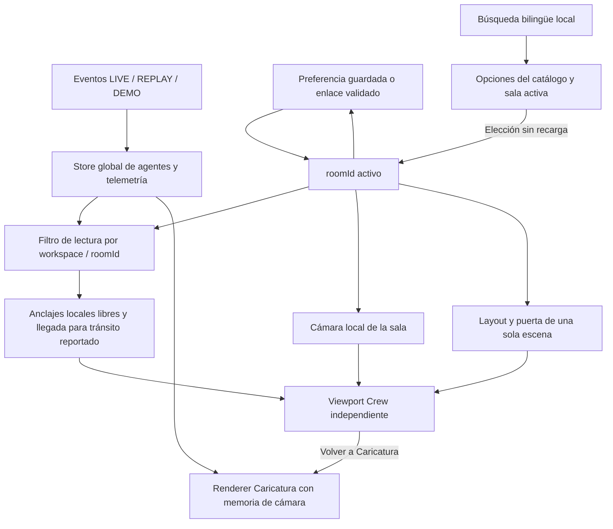

# Catálogo y selección Crew, #168

Contrato implementado sobre [ADR-001](../adr/ADR-001-crew-camera.md). Este registro corresponde exclusivamente a #168; no certifica arte final de oficinas ni G1.

## Contrato público de escena y presencia

`CrewRoomDefinition` en `src/crew/crewModel.ts` define ID estable, nombre ES/EN, tipo, ancho/profundidad locales, mobiliario, capacidad de representación, puertas y llegadas. Once escenas: Dirección, Desarrollo, Planificación, Investigación, QA, Finanzas, Reuniones, Infraestructura, Café, Lounge y Recepción. `crewRoom(id)` valida identidad. Puertas pertenecen a la pared sur en coordenadas locales y tienen ancho y desplazamiento; el renderer proyecta su umbral en cada cámara.

La capacidad es el número efectivo de anclajes libres calculado por `crewPresenceSlots`, excluyendo paredes y huellas de mobiliario. No limita ni modifica el conjunto de agentes del dominio. El selector muestra ocupación/capacidad; el panel mantiene visibles nombres y estados de agentes que exceden los anclajes, con aviso de falta de espacio.

`crewRoomForWorkspace` y `crewAgentsInRoom` son un filtro de lectura del snapshot global. Workspace desconocido permanece sin representación. Finanzas, Café y Recepción están disponibles pero vacías mientras no exista asignación canónica autorizada en el dominio. No se infieren trabajadores a partir de muebles ni roles.

El tránsito usa exclusivamente `isWalking` reportado por el snapshot: el panel lo identifica y el primer viajero puede ocupar una llegada libre de su sala actual. Otros viajeros usan posiciones libres si la llegada está ocupada. El cambio de workspace retira la presencia de la sala anterior y la muestra en la nueva. No se inventa una sala de destino, una trayectoria, una reserva ni un evento; las coordenadas del dominio permanecen intactas.

`CrewRoomSelector` recibe `roomId`, callback de elección, agentes, idioma y prefijo de IDs por instancia. Busca IDs y nombres de ambos idiomas sin distinguir acentos; conserva la sala activa dentro de las opciones, incluso sin coincidencias. Buscar no cambia selección. Flechas, Inicio y Fin eligen oficinas de forma explícita y accesible. IDs únicos permiten múltiples instancias embebidas.

La carga del catálogo es síncrona y local: no existe petición de salas ni estado de error ficticio. Un enlace inválido usa Dirección con aviso de recuperación. Las ilustraciones se cargan de forma diferida con mensaje de carga y fallback de error; mobiliario y marcadores permanecen disponibles. Una sala vacía anuncia su estado y dibuja únicamente su mobiliario. El hook cancela resultados tardíos al cambiar sala/vista.

## Flujo de estado



La elección no filtra la ingestión de eventos: las otras salas mantienen presencia, estados y consumo en el mismo store. Crew no importa el renderer Caricatura ni la rama del PR #43. Modo, cámara y sala preservan el comportamiento de preferencias existente, revisado conjuntamente con #171.

## Criterios y evidencia

| Criterio de #168 | Evidencia verificable |
| --- | --- |
| Catálogo, sala activa y cambio sin recarga | `crewRoomSelector.test.tsx`; `crew-catalog.spec.ts` |
| Solo paredes, muebles y actores de sala elegida | `renderCrewRoom.test.ts`, `crewPresence.test.ts`; Desarrollo contiene solo Catalog Developer mientras CEO/Reviewer existen en el store |
| Sala vacía con mobiliario | E2E LIVE vacío recorre las once salas; captura móvil Investigación vacía |
| Eventos ajenos continúan en el store | E2E catálogo recibe QA TESTING y coste 0,120 mientras Desarrollo permanece activo; al abrir QA aparece el estado recibido |
| Cambios rápidos y recarga | E2E catálogo alterna cinco salas y recarga Desarrollo; suite de navegación conserva cámara y modo |
| Teclado, móvil y reduced-motion | E2E catálogo usa flechas y 320 px ES; suite cámara usa teclado, pinch y movimiento reducido |
| No regresión Caricatura | E2E cámara compara PNG antes/después de volver; suites dominio/embebido conservan eventos y consumo |
| Interfaces, eventos, cámara y accesibilidad | Contrato anterior, diagrama y pruebas unitarias; revisión de integración en PR, sin cambios a API de eventos/telemetría |

Capturas del runtime real Crew, con eventos sintéticos inequívocamente identificados en el test: [escritorio](evidence/catalog-168/catalog-desktop.png), [móvil](evidence/catalog-168/catalog-mobile.png), [grabación](evidence/catalog-168/catalog-runtime.mp4). Se revisaron visualmente: búsqueda y selector accesibles, mobiliario de la sala elegida, cero personajes inventados en Investigación, canvas sin oclusión a 320 px. El conjunto integrado con #171 también se verificó visualmente en [360 × 740](evidence/catalog-168/catalog-mobile-360.png) y [390 × 844](evidence/catalog-168/catalog-mobile-390.png): botones, checkbox, selector y búsqueda visibles; altura del canvas al menos 120 px y centro sin oclusión.

## Reproducción y validación

```sh
npm ci
npm run lint
npm test
PLAYWRIGHT_CHANNEL=chrome npm run test:e2e
npm run build
npm run build:lib
npm run build:cli
npm run check:package
npm audit --omit=dev
python3 tests/test_python_sdk.py
```

La ejecución aislada de este issue usa puerto 3168 mediante configuración temporal equivalente a `playwright.config.ts` con baseURL y webServer en 3168. No usa el servidor compartido en 3000. Playwright conserva video, capturas y trazas en `test-results`; CI publica estos artefactos.

Verificaciones locales: TypeScript; 472 Node aprobados y uno omitido; 607 Vitest; 19 E2E Chrome; builds app/lib/CLI; validación del paquete; audit de producción sin vulnerabilidades; SDK Python. CI del PR vuelve a ejecutar los checks y builds Docker.

Limitaciones de evidencia: Chrome headless sobre macOS y móvil emulado, sin dispositivo físico ni Safari certificado. El catálogo utiliza geometría provisional y marcadores en los roles cuyo arte continúa pendiente en otros issues. Esta entrega no declara arte final, locomoción animada ni aprobación de G1. No cambia ni cierra otros tickets por añadir geometría.

## Trazabilidad de entrega

[PR #222](https://github.com/jmmana/Agent-Viewer/pull/222), implementación inicial `c9cacbb`, teclado `c820686`; integración de preferencias #171 mediante merge `2ac7bdd`, sin squash. [CI del PR y commit vigente](https://github.com/jmmana/Agent-Viewer/pull/222/checks) valida el conjunto. La revisión del mantenedor autoriza la integración final; este agente no fusiona ni cierra #168.
