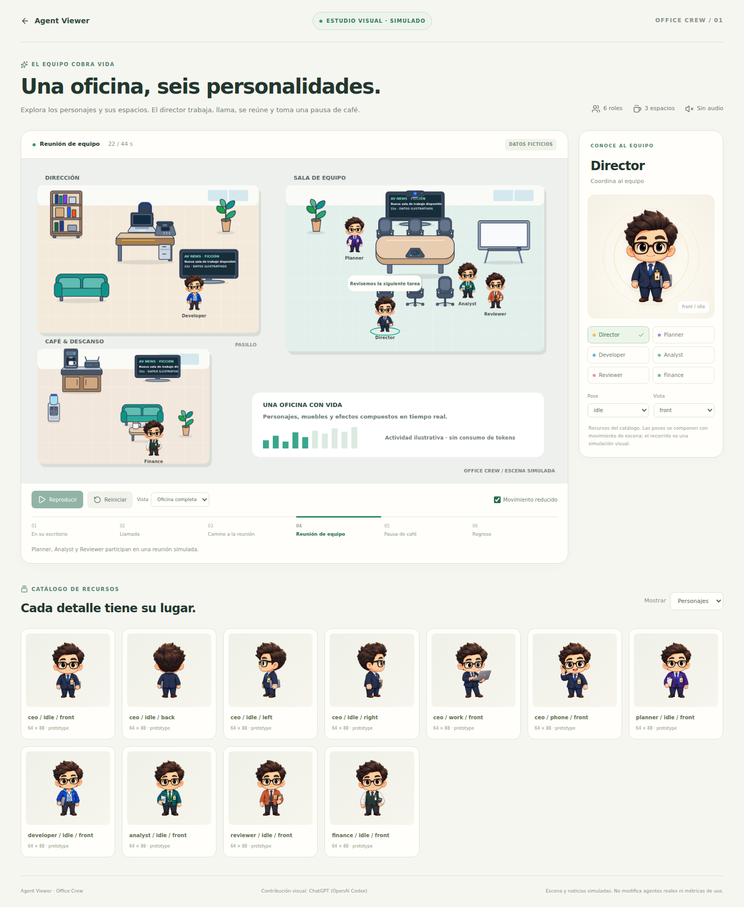

# Agent Viewer Office Crew

The [user-approved CEO reference sheet](../../assets/references/ceo-approved-concept.png) defines the visual identity. The earlier [CEO SVG](../../assets/characters/ceo/idle-front.svg) was an independently drawn technical placeholder. It did not reproduce the illustration and is now excluded from the runtime catalog.

The app uses reference-derived transparent PNGs. Public-library consumers opt in with `characterStyle="office-crew"`; existing integrations keep the procedural default. Artwork retains `prototype` status pending final visual review.

## Preview

Run `npm ci`, then `npm run dev`. Open `http://localhost:3000/?visualStudio=1` for the showroom, or `/` for the main app with Office Crew characters.

The showroom includes six roles, CEO poses/facings, an asset gallery, pause/reset and reduced motion. Its director moves between three rooms, works with a laptop, calls with phone/Wi-Fi effects, meets the team and visits coffee. TV headlines and activity bars are explicitly fictional. No operational state or model/token metric is modified.

## Delivery status

| Component | Delivered | Remaining |
|---|---|---|
| Six roles | Six faithful front PNGs and high-resolution originals | Five roles' other raster directions/poses |
| CEO | Four idle directions, work and phone poses | Raster frame cycles and seated transitions |
| Office | 20 furniture/props, 13 electronics, nine effects | Operational-office furnishing integration |
| Rooms | Director, meeting, coffee layouts and showroom | Other rooms in master guide |
| Canvas2D | Sprite loading, feet anchors, rotation, timing, fallback, reduced motion | Final raster animation artwork |
| Motion studies | 1,584 vector frames, six roles × 12 clips × four directions | Recreate final motion in the reference raster style |

**Vector studies are technical references, not matching production artwork.** They have a [separate catalog](../../assets/characters/catalog.json), live under `assets/characters/*/vector-study/`, and are excluded from runtime/published bundles. Moving an idle sprite is scene choreography, not a finished walking cycle. The old SVG never silently replaces the illustrated character.

## Files and checks

- Runtime character exports: 256×352 RGBA; logical64×88; anchor `(0.5, 330/352)`.
- Full generated originals: `assets/characters/<role>/source/`, never bundled.
- [Runtime catalog](../../assets/asset-manifest.json): 53 resources, comprising 11 character poses and 42 environment assets.
- Environment catalog: `assets/furniture/catalog.json`; room layouts: `assets/rooms/`.
- [CEO prompt guide](PROMPTS-CEO.md), [Reviewer/Finance prompts](prompts-reviewer-finance.md), and Planner/Developer/Analyst role-local `provenance.json` record sources.

Run `npm run validate:assets`, `node scripts/generate-office-crew.mjs --check`, `npm run lint`, `npm test`, `npm run build`, `npm run build:lib` and `npm run check:package`.

`generate-office-environment.mjs` regenerates original furniture/equipment/effects and layouts. `generate-office-crew.mjs` regenerates **vector studies only**, preserving PNG originals. For mechanical PNG normalization, optionally install Sharp with `npm install --no-save sharp`, then run `node scripts/normalize-character.mjs <source.png> <runtime.png>`; originals are never overwritten.

## Design and attribution

[Master guide](MASTER-DESIGN-GUIDE.es.md), [style](STYLE-GUIDE.md), [roles](CHARACTERS.md), [motion](ANIMATIONS.md), [catalog conventions](ASSET-CATALOG.md), [contributors](../../CONTRIBUTORS.md).

ChatGPT (OpenAI Codex) is explicitly credited for this delivery. New character art must use the canonical sheet and corresponding front pose as references, preserve identity/proportions and pass visual review before registration. Reference sheets are never interpreted as finished sprite atlases.
